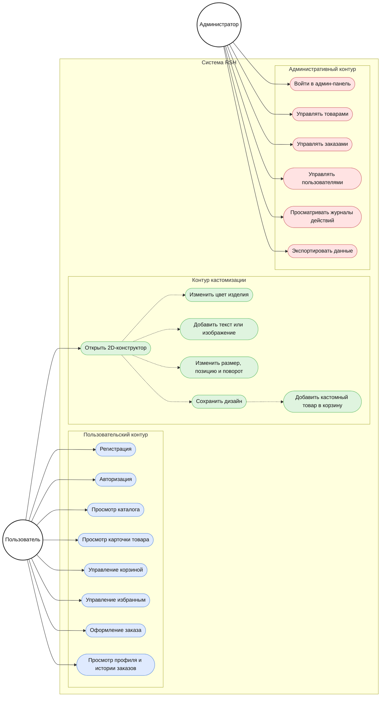
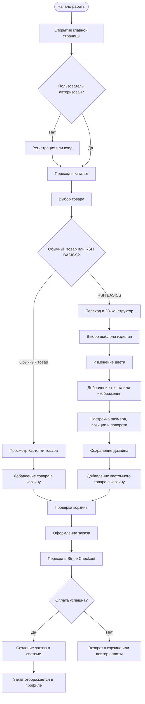
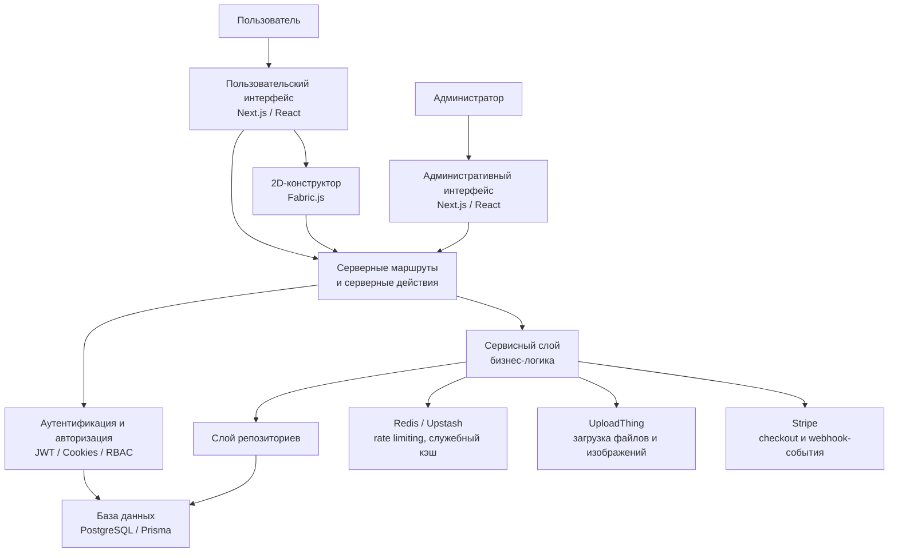
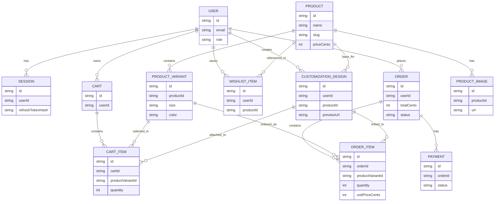

# Готовые диаграммы для дипломной работы RSH

Ниже приведены обновлённые диаграммы для дипломного проекта. В этой версии все основные обозначения переведены на русский язык, а структура диаграмм адаптирована под более понятную для комиссии форму представления. При необходимости их можно перенести в draw.io, Visio или PowerPoint практически без изменения логики.

---

## 1. Диаграмма вариантов использования (Use Case)

**Подпись для диплома:**

**Рисунок 1 — Диаграмма вариантов использования веб-приложения RSH**

### Что говорить по этой диаграмме на защите

Диаграмма вариантов использования показывает разделение системы RSH на три основных функциональных контура: пользовательский, контур кастомизации и административный контур. Пользователь взаимодействует с каталогом, карточками товаров, корзиной, избранным, оформлением заказа и личным кабинетом. Отдельно выделен блок 2D-конструктора, в котором пользователь может изменить цвет изделия, добавить графику или текст, отредактировать размещение элементов и сохранить кастомный дизайн. Администратор использует собственный набор сценариев для сопровождения платформы, управления товарами, заказами, пользователями и служебными журналами.

---

## 1.1. Диаграмма пользовательского сценария (User Flow)

**Подпись для диплома:**

**Рисунок 2 — Диаграмма пользовательского сценария оформления заказа и кастомизации в системе RSH**

### Что говорить по этой диаграмме на защите

Данная схема отражает не набор функций системы, а последовательность действий пользователя при работе с платформой. В рамках сценария пользователь может либо приобрести обычный товар из каталога, либо перейти в конструктор линейки RSH BASICS, создать персонализированный дизайн и добавить кастомизированное изделие в корзину. После этого обе ветви сценария сходятся в единую точку оформления заказа и оплаты через Stripe Checkout. Такая схема хорошо демонстрирует практический путь пользователя внутри системы.

---

## 1.2. Когда использовать Use Case, а когда User Flow

В дипломной работе лучше использовать **обе схемы**, потому что они отвечают на разные вопросы:

1. **Use Case** показывает, **какие функции есть в системе и кто ими пользуется**.
2. **User Flow** показывает, **как именно пользователь проходит путь от входа на сайт до оформления заказа**.

Если руководитель просил схему "как на примере с человечками и овалами", то это именно **Use Case**. Если дополнительно хотят показать маршрут пользователя внутри интерфейса, тогда вставляется ещё и **User Flow**. Для диплома по проекту RSH это будет сильным решением, потому что комиссия увидит и функциональный состав системы, и реальный пользовательский сценарий.

---

## 2. Архитектурная схема системы

**Подпись для диплома:**

**Рисунок 2 — Архитектурная схема веб-приложения RSH**

### Что говорить по этой диаграмме на защите

Архитектурная схема демонстрирует модульное построение системы. Пользовательский интерфейс не работает напрямую с базой данных, а обращается к серверной логике. Серверная часть передаёт управление в сервисный слой, где сосредоточены бизнес-правила. Доступ к данным инкапсулирован в репозиториях, а инфраструктурные интеграции, такие как платежи, Redis и загрузка файлов, подключены как отдельные сервисные компоненты. Это подтверждает инженерную целостность проекта.

---

## 3. Логическая ER-диаграмма базы данных

**Подпись для диплома:**

**Рисунок 3 — Логическая ER-диаграмма базы данных проекта RSH**

### Что говорить по этой диаграмме на защите

ER-диаграмма показывает структуру хранения данных в проекте RSH. Центральной сущностью является пользователь, связанный с сессиями, корзинами, заказами, избранным и пользовательскими дизайнами. Товар отделён от вариантов и изображений, что соответствует нормализованной модели каталога. При этом корзина и заказ могут работать как с обычными товарными позициями, так и с кастомными дизайнами, что отражает специфику проекта как интернет-магазина с модулем персонализации изделий.

---

## 4. Что важно сделать перед вставкой в диплом

1. При желании перенести эти схемы в draw.io для более красивой визуальной подачи.
2. Сохранить все подписи рисунков в едином стиле.
3. После каждой диаграммы оставить короткое пояснение на 3–5 предложений.
4. Использовать русские обозначения в тексте и на схемах, чтобы комиссия быстро понимала логику проекта.

## 5. Практическая рекомендация

Если времени мало, можно использовать эти диаграммы как готовую смысловую основу, а затем просто аккуратно перерисовать их в draw.io. Такой путь даст лучший внешний вид без необходимости заново продумывать структуру системы.
