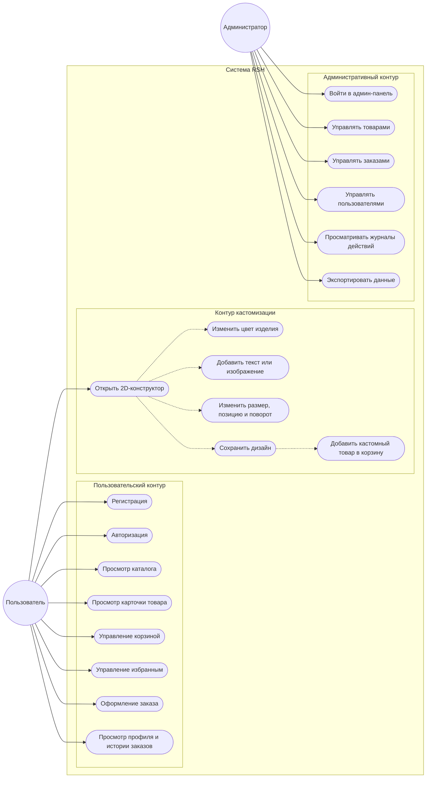
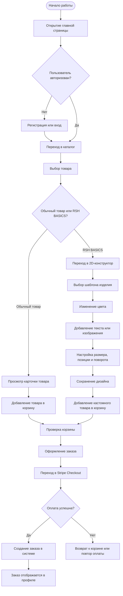
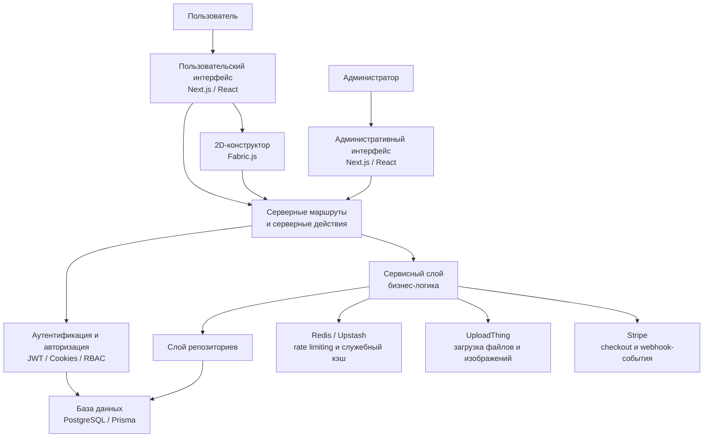
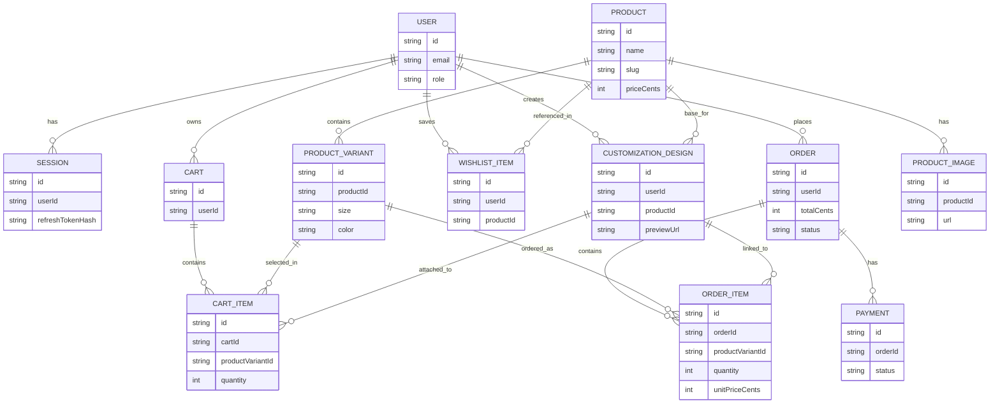

# ДИПЛОМНАЯ РАБОТА

## Проектирование и разработка веб-приложения интернет-магазина брендовой одежды с 2D-конструктором кастомизации изделий

### Проект: RSH

---

## Содержание

1. Введение
2. Глава 1. Теоретические основы и анализ предметной области
3. Глава 2. Проектирование, реализация и развертывание веб-приложения RSH
4. Заключение
5. Список использованных источников
6. Приложение А. Блоки для вставки диаграмм
7. Приложение Б. Блоки для вставки скриншотов

---

> Это итоговая почти готовая версия дипломного текста. Для завершения документа требуется только вставить финальные изображения диаграмм и скриншоты интерфейса в отмеченные места.

---
# ВВЕДЕНИЕ

В условиях активного развития цифровой экономики и устойчивого роста рынка электронной коммерции особую значимость приобретает разработка современных веб-приложений, обеспечивающих удобное, безопасное и персонализированное взаимодействие пользователя с торговой платформой. Одним из наиболее динамично развивающихся сегментов eCommerce является онлайн-продажа одежды, где конкурентоспособность интернет-магазина определяется не только широтой ассортимента, но и качеством пользовательского опыта, скоростью оформления заказа, надежностью платежной инфраструктуры, а также возможностью предложить покупателю индивидуализированный продукт.

Современный потребитель предъявляет повышенные требования к цифровым торговым сервисам. Пользователь ожидает от интернет-магазина интуитивно понятный интерфейс, структурированный каталог, гибкую фильтрацию, достоверную информацию о товарах, удобную корзину, прозрачный процесс оформления заказа и доступ к истории покупок. Одновременно с этим усиливается спрос на инструменты персонализации, позволяющие не только выбирать готовые изделия, но и адаптировать отдельные товары под индивидуальные предпочтения. В сфере продажи одежды данная тенденция особенно заметна, поскольку для покупателя важны не только функциональные характеристики изделия, но и его визуальная уникальность, соответствие собственному стилю и возможность частичного участия в формировании конечного внешнего вида товара.

Дополнительную актуальность теме придает развитие технологий интерактивной графики и клиентских веб-интерфейсов, благодаря которым стало возможным реализовывать в браузере инструменты визуальной кастомизации товаров. Использование 2D-конструктора одежды в составе интернет-магазина позволяет объединить традиционный eCommerce-сценарий с сервисом индивидуального проектирования изделия. Это повышает вовлеченность пользователя, увеличивает глубину взаимодействия с платформой и формирует дополнительную коммерческую ценность продукта. В то же время реализация подобной системы требует решения комплекса задач, связанных с архитектурой веб-приложения, безопасностью, хранением данных, обработкой пользовательских дизайнов, интеграцией платежных сервисов и организацией административного управления контентом и заказами.

Таким образом, разработка веб-приложения интернет-магазина брендовой одежды с поддержкой 2D-конструктора кастомизации изделий является актуальной и практически значимой задачей. Она находится на пересечении направлений веб-разработки, электронной коммерции, проектирования пользовательских интерфейсов и построения масштабируемых информационных систем.

Целью дипломного проекта является проектирование и разработка веб-приложения интернет-магазина брендовой одежды с 2D-конструктором кастомизации базовых изделий, обеспечивающего удобный пользовательский сценарий выбора и покупки товаров, безопасную обработку заказов и возможность сохранения персонализированных дизайнов.

Для достижения поставленной цели необходимо решить следующие задачи:

1. Провести анализ литературных источников, научных публикаций и электронных ресурсов, посвященных разработке интернет-магазинов, систем персонализации пользовательского опыта и цифровых сервисов кастомизации одежды.
2. Выполнить анализ предметной области, определить ключевые сущности, пользовательские роли и основные бизнес-процессы проектируемой системы.
3. Провести обзор и сравнительный анализ существующих интернет-магазинов одежды, а также сервисов, предоставляющих инструменты персонализации и конструирования дизайна изделий.
4. Выполнить анализ инструментальных средств и технологий, применимых для реализации клиентской и серверной частей веб-приложения, системы хранения данных, аутентификации, оплаты и загрузки пользовательских материалов.
5. Сформулировать функциональные и нефункциональные требования к разрабатываемой системе, включая требования к безопасности, производительности, удобству использования и масштабируемости.
6. Разработать архитектуру веб-приложения, определить структуру модулей, принципы взаимодействия компонентов и модель данных.
7. Реализовать основной функционал интернет-магазина, включающий каталог товаров, карточки товаров, поиск, фильтрацию, корзину, избранное, личный кабинет пользователя и административную панель.
8. Реализовать 2D-конструктор кастомизации базовых изделий с возможностью добавления текста и графических элементов, изменения параметров объектов, сохранения пользовательского дизайна и формирования превью результата.
9. Интегрировать подсистему оформления заказа и оплаты, а также обеспечить сохранение и отображение заказов в пользовательском профиле и административной части системы.
10. Провести тестирование работоспособности ключевых сценариев и подготовить систему к последующему развертыванию в production-среде.

Объектом исследования является процесс организации онлайн-продажи брендовой одежды и кастомизации базовых изделий в рамках веб-приложения электронной коммерции.

Предметом исследования являются методы, архитектурные подходы, программные технологии и инструментальные средства проектирования и реализации интернет-магазина брендовой одежды с интегрированным 2D-конструктором кастомизации.

Практическая значимость дипломного проекта заключается в создании работоспособного программного решения, ориентированного на реальный пользовательский сценарий взаимодействия с интернет-магазином. Разрабатываемое приложение позволяет объединить в рамках единой цифровой платформы каталог брендовой одежды, механизм оформления заказа, пользовательский кабинет, административную подсистему и инструмент визуальной кастомизации базовых изделий. Полученный результат может быть использован как основа для дальнейшего коммерческого развития проекта, масштабирования товарной матрицы, интеграции с внешними поставщиками, расширения логистических сценариев и вывода системы в публичную эксплуатацию.

Кроме того, практическая ценность проекта определяется тем, что в ходе его разработки применяются современные технологии построения веб-приложений, включая компонентный клиентский интерфейс, серверную обработку данных, реляционную модель хранения, безопасную аутентификацию, интеграцию платежной системы, управление пользовательскими файлами и организацию модульной архитектуры, пригодной для сопровождения и дальнейшего расширения. Это делает проект значимым не только как прикладное решение, но и как пример комплексной разработки современного eCommerce-продукта.

---

# 1.1 Анализ литературных источников и электронных ресурсов по теме дипломного проекта

Разработка современного интернет-магазина одежды с поддержкой персонализации товаров относится к числу междисциплинарных задач, находящихся на пересечении электронной коммерции, проектирования веб-приложений, пользовательского интерфейса, графических интерактивных систем и информационной безопасности. Поэтому для обоснования темы дипломного проекта необходимо рассмотреть несколько групп источников: публикации, посвященные развитию электронной коммерции; материалы, раскрывающие подходы к персонализации цифрового опыта; исследования в области кастомизации товаров; а также профессиональные и технические источники, описывающие современные средства разработки масштабируемых веб-систем.

В научной и прикладной литературе по цифровой экономике подчеркивается, что электронная коммерция давно перестала быть лишь альтернативным каналом продаж и превратилась в самостоятельную инфраструктурную среду взаимодействия бизнеса и потребителя. Интернет-магазин в современных условиях рассматривается не только как витрина товаров, но и как полноценная информационная система, обеспечивающая коммуникацию с пользователем, управление ассортиментом, обработку заказов, оплату, доставку, аналитику и последующее сопровождение клиента. В связи с этим исследователи и практики всё чаще обращают внимание на необходимость интеграции в eCommerce-решения не только стандартных торговых модулей, но и инструментов, повышающих вовлеченность пользователя и позволяющих формировать дополнительную ценность продукта.

Одним из ключевых направлений развития электронной коммерции является персонализация пользовательского опыта. В литературе по маркетингу, цифровым платформам и UX-проектированию персонализация рассматривается как средство повышения конверсии, лояльности и повторных покупок. Если на ранних этапах под персонализацией преимущественно понимались рекомендации товаров, специальные предложения и адаптация контента, то в более современных цифровых сервисах персонализация всё чаще переходит на уровень модификации самого продукта. Для сферы одежды это выражается в возможности выбора конфигурации изделия, визуальных параметров, декоративных элементов и способов нанесения индивидуального оформления. Следовательно, в рамках проектирования интернет-магазина одежды актуальным становится не только вопрос реализации каталога и checkout-процесса, но и вопрос внедрения интерфейса, позволяющего пользователю участвовать в формировании конечного облика товара.

Анализ электронных ресурсов, посвященных кастомизации потребительских товаров, показывает, что особенно востребованными являются решения, где пользователь может получить быстрый визуальный результат без необходимости установки дополнительного программного обеспечения. Браузерный конструктор одежды в таком случае становится удобным инструментом массовой персонализации. Он позволяет совмещать преимущества онлайн-покупки с элементами визуального проектирования. Для пользователя это означает более высокий уровень контроля над результатом, а для владельца платформы — расширение продуктовой линейки и повышение ценности базового ассортимента. В то же время подобные решения предъявляют повышенные требования к архитектуре фронтенда, обработке графических объектов, сохранению промежуточного состояния, генерации превью и корректной передаче данных о кастомном товаре в корзину и заказ.

С точки зрения предметной области одежды интерес представляют исследования и практические материалы, описывающие специфику онлайн-продажи fashion-товаров. Для данного сегмента характерны высокая визуальная нагрузка интерфейса, необходимость работы с несколькими изображениями товара, важность фильтрации по бренду, размеру, цвету и цене, а также необходимость формирования доверия к качеству и подлинности изделий. В отличие от продажи типовых товаров, покупка одежды требует более развитой визуальной поддержки: качественных карточек товара, понятной типизации вариантов, ясной информации о материалах, посадке, доступных размерах и условиях возврата. Если в такую систему дополнительно встраивается кастомизация базовых изделий, проект должен чётко разделять стандартные брендовые товары и линейку изделий, допустимых к изменению пользователем. Данный аспект особенно важен как с точки зрения бизнес-логики, так и с точки зрения юридической и коммерческой корректности проекта.

Отдельный блок источников связан с вопросами проектирования программной архитектуры. Современные публикации по веб-разработке и инженерии программного обеспечения подчеркивают важность модульности, разделения ответственности, безопасной обработки данных и возможности последующего масштабирования системы. Для приложений электронной коммерции это особенно критично, поскольку система одновременно обслуживает публичный каталог, пользовательскую аутентификацию, платежные операции, работу с корзиной, административные функции и, в рассматриваемом случае, графический редактор. Следовательно, использование архитектурного подхода, предполагающего раздельное выделение UI-уровня, бизнес-логики, валидации, слоя доступа к данным и внешних интеграций, является обоснованным и соответствует современным инженерным практикам.

Значительный интерес для дипломного проекта представляют профессиональные электронные ресурсы и официальная документация используемых технологий. В отличие от обзорных статей, именно документация фреймворков, ORM-средств, библиотек работы с графикой, систем загрузки файлов и платежных шлюзов позволяет получить точное представление о возможностях и ограничениях конкретных инструментов. Для разработки веб-приложения интернет-магазина важны, в частности, источники по компонентной организации клиентского интерфейса, серверному рендерингу, управлению состоянием, маршрутизации, работе с базой данных, организации аутентификации, безопасной обработке cookie, webhook-событиям и файловым хранилищам. Изучение таких ресурсов позволяет не только выбрать технологический стек, но и реализовать систему в соответствии с production-практиками, а не в виде учебного прототипа.

Существенное место в анализе источников занимают материалы, посвященные информационной безопасности веб-приложений. Для интернет-магазина, обрабатывающего пользовательские аккаунты, корзины, персональные данные и платежные операции, вопросы безопасности являются не дополнительной опцией, а обязательной частью проектирования. В профессиональной литературе и технических руководствах особое внимание уделяется защите сессий, безопасной аутентификации, валидации входных данных, ролевой модели доступа, защите от CSRF-атак, ограничению частоты запросов и безопасной интеграции платежных провайдеров. В контексте дипломного проекта это особенно важно, поскольку система должна рассматриваться как потенциально публичная платформа, а не исключительно как демонстрационная разработка.

Наряду с безопасностью значимым направлением анализа являются вопросы производительности и удобства использования. Источники по UX-проектированию, клиентской оптимизации и frontend-инженерии указывают, что качество цифрового продукта определяется не только набором функций, но и скоростью их работы, логикой интерфейса, предсказуемостью поведения элементов и удобством сценариев для разных категорий пользователей. Для интернет-магазина это означает необходимость оптимизации страниц каталога и карточек товара, рационального разделения серверной и клиентской логики, снижения времени загрузки изображений, а также аккуратного проектирования интерактивных модулей, в частности редактора кастомизации. Если пользовательский интерфейс конструктора перегружен, работает нестабильно или не даёт понятной визуальной обратной связи, это отрицательно сказывается на восприятии всего проекта. Поэтому анализ источников в данной области подтверждает необходимость строить редактор не как изолированный экспериментальный модуль, а как органичную часть пользовательского сценария интернет-магазина.

Проведенный анализ литературных источников и электронных ресурсов позволяет сделать вывод о высокой актуальности темы дипломного проекта. Современные тенденции развития электронной коммерции, цифровой персонализации и интерактивных веб-интерфейсов создают обоснованный запрос на создание интернет-магазина брендовой одежды, дополненного модулем 2D-кастомизации базовых изделий. С одной стороны, существует устойчивая потребность в качественных eCommerce-платформах, обеспечивающих полноценный цикл онлайн-покупки. С другой стороны, возрастает интерес к решениям, позволяющим пользователю не только выбирать товар, но и участвовать в формировании его внешнего вида. Анализ профессиональных и технических источников также показывает, что для реализации подобной системы доступны зрелые инструменты, позволяющие построить масштабируемое, безопасное и функционально насыщенное веб-приложение.

Таким образом, исследуемая тема обладает как теоретической, так и практической значимостью. Она соответствует современным направлениям развития цифровых торговых платформ и предоставляет широкие возможности для комплексного рассмотрения вопросов архитектуры, интерфейса, безопасности, хранения данных, обработки пользовательской графики и организации коммерческих сценариев в рамках единого программного продукта.

---

# 1.2 Предметная область

Предметная область дипломного проекта охватывает процессы онлайн-продажи брендовой одежды и персонализации базовых изделий в рамках единого веб-приложения электронной коммерции. В отличие от традиционного интернет-магазина, который ограничивается демонстрацией ассортимента, предоставлением информации о товарах и оформлением заказа, разрабатываемая система объединяет стандартные торговые сценарии с интерактивным модулем 2D-кастомизации. Это определяет как состав основных сущностей системы, так и особенности логики взаимодействия между пользователем, каталогом, корзиной, заказами и механизмом создания индивидуального дизайна.

Центральным объектом предметной области выступает товар. В контексте проекта товары разделяются на две основные категории. Первая категория — это стандартные брендовые изделия, представленные в каталоге интернет-магазина в неизменяемом виде. Такие товары имеют фиксированные характеристики: наименование, бренд, описание, стоимость, изображения, доступные размеры, цвета и сведения о наличии. Вторая категория — это базовые изделия внутренней линейки, предназначенные для пользовательской кастомизации. Для них, помимо стандартных товарных параметров, важным становится наличие шаблона изделия, печатной области, поддерживаемых цветов и связанных пользовательских дизайнов. Таким образом, уже на уровне предметной области требуется чёткое разграничение между обычным товаром и кастомизируемым изделием.

С точки зрения пользовательского сценария система ориентирована на несколько ролей. Первая роль — гость, то есть пользователь, который заходит на сайт без авторизации. Он должен иметь возможность просматривать каталог, использовать фильтрацию, открывать карточки товаров, добавлять позиции в корзину и знакомиться с возможностями 2D-конструктора. При этом часть сценариев, связанных с сохранением дизайнов, подтверждением покупки и доступом к истории заказов, для гостя ограничена или недоступна. Вторая роль — зарегистрированный пользователь. Помимо всех возможностей гостя, он получает доступ к личному кабинету, избранному, истории заказов, сохранённым пользовательским дизайнам, а также к полному сценарию оформления покупки. Третья роль — администратор. Для него система предоставляет интерфейс управления товарами, заказами, пользователями, контентом и параметрами платформы. Наличие данных ролей означает, что предметная область проекта включает не только торговую логику, но и элементы ролевого управления доступом.

Существенную часть предметной области составляет каталог товаров. Каталог в рамках веб-приложения выполняет не только презентационную функцию, но и служит основной точкой входа в коммерческий сценарий. С ним связаны процессы поиска, фильтрации, пагинации, перехода к карточке товара и выбора варианта изделия. Для сегмента брендовой одежды особенно важны фильтры по бренду, стоимости, размеру, типу изделия и цвету. В связи с этим в предметной области фиксируется набор товарных атрибутов, необходимых для эффективной навигации пользователя по ассортименту. От корректного проектирования этой части системы зависит не только удобство интерфейса, но и коммерческая эффективность платформы, поскольку именно каталог формирует основу пользовательского выбора.

Следующим ключевым элементом предметной области является карточка товара. В рамках рассматриваемого проекта карточка должна выступать детальным представлением единицы ассортимента и содержать все сведения, влияющие на решение о покупке: название изделия, бренд, описание, изображения, стоимость, доступные варианты, характеристики материала, размеры, цветовые исполнения, а также возможность перехода к покупке или кастомизации. Для стандартных брендовых товаров карточка решает задачу информирования и конверсии в корзину. Для базовых изделий карточка дополнительно может выступать переходной точкой к 2D-редактору, где пользователь создаёт собственный дизайн.

Корзина и оформление заказа представляют отдельный блок предметной области, связанный с фиксацией пользовательского выбора и переходом от просмотра к покупке. Корзина должна поддерживать как обычные товары, так и кастомные позиции, для которых, помимо идентификатора изделия и количества, необходимо учитывать связанный дизайн. Это усложняет модель данных по сравнению с типовым интернет-магазином, так как к позиции заказа должен быть привязан не только товар и его вариант, но и визуальная конфигурация, созданная пользователем. На этапе оформления заказа значимыми становятся проверка актуальности данных, вычисление итоговой стоимости, сохранение состава покупки, инициирование платежной сессии и последующее подтверждение заказа после успешной оплаты.

Особое место в предметной области занимает модуль 2D-конструктора одежды. Его задача заключается в предоставлении пользователю интерактивного инструмента изменения внешнего вида базового изделия. С точки зрения бизнес-логики конструктор работает не как отдельное приложение, а как часть торгового процесса. Это означает, что результат работы редактора должен быть не абстрактным изображением, а конкретным пользовательским дизайном, связанным с товаром, пригодным для сохранения, повторного открытия, отображения в профиле и последующего добавления в корзину. Внутри данного сценария предметная область включает такие сущности, как шаблон изделия, сторона изделия, печатная область, графический объект, текстовый слой, изображение пользователя, JSON-представление дизайна и превью кастомного результата.

С точки зрения логики взаимодействия, кастомизация включает несколько последовательных действий. Пользователь выбирает базовое изделие, открывает редактор, определяет сторону изделия, размещает текстовые и графические элементы, меняет параметры объектов, при необходимости изменяет цвет основы и после завершения работы сохраняет дизайн. Далее этот дизайн должен либо сохраняться в профиле пользователя, либо быть использован в процессе добавления товара в корзину. Следовательно, предметная область проекта охватывает не только визуальную часть редактирования, но и полный жизненный цикл пользовательского дизайна как значимого объекта системы.

Важной особенностью рассматриваемой предметной области является наличие административных процессов. Для реальной эксплуатации интернет-магазина недостаточно реализовать только клиентскую витрину. Необходимы средства управления ассортиментом, состоянием заказов, учётными записями пользователей, логами действий и базовыми настройками системы. Поэтому в структуру предметной области включаются административные операции: создание и редактирование товаров, изменение цен и описаний, управление вариантами товара, просмотр заказов, изменение их статуса, мониторинг пользовательской активности и контроль событий, влияющих на стабильность и безопасность платформы. Таким образом, проектируемая система выступает не просто пользовательским сайтом, а полнофункциональной торговой информационной системой.

Следует также учитывать юридические и коммерческие ограничения предметной области. Поскольку в проекте рассматривается продажа брендовой одежды, публичный запуск подобной платформы требует подтверждения легальности происхождения товара, наличия поставщиков и соблюдения прав на реализацию брендов. Кроме того, отдельного внимания требуют правила обработки персональных данных, условия оплаты, политика возврата и иные документы, сопровождающие коммерческую эксплуатацию интернет-магазина. Несмотря на то, что часть этих аспектов выходит за пределы сугубо программной реализации, они непосредственно влияют на требования к информационной системе и должны учитываться на этапе проектирования.

Таким образом, предметная область дипломного проекта представляет собой совокупность взаимосвязанных процессов, охватывающих продажу одежды, управление ассортиментом, пользовательскую персонализацию базовых изделий, оформление заказов, хранение пользовательских данных, выполнение административных операций и обеспечение безопасной работы платформы. Специфика проекта заключается в объединении классического интернет-магазина и модуля кастомизации в рамках единой веб-системы, что делает предметную область более сложной по сравнению с типовым eCommerce-решением и требует комплексного подхода к проектированию архитектуры и бизнес-логики.

---

# 1.3 Обзор аналогов

Для обоснования проектных решений, принятых при разработке веб-приложения RSH, необходимо рассмотреть существующие программные решения, близкие к теме дипломного проекта. Поскольку разрабатываемая система сочетает в себе функциональность интернет-магазина брендовой одежды и модуля 2D-кастомизации базовых изделий, в качестве аналогов целесообразно анализировать не только классические fashion eCommerce-платформы, но и сервисы, предоставляющие пользователю возможность индивидуального визуального изменения товара. В рамках данного раздела аналоги условно разделяются на три группы: маркетплейсы и крупные интернет-магазины одежды, официальные брендовые онлайн-магазины, а также специализированные сервисы кастомизации одежды и мерча.

К первой группе относятся крупные маркетплейсы и универсальные интернет-магазины, реализующие широкий ассортимент одежды различных брендов. Подобные платформы обладают развитой инфраструктурой каталогизации, мощными системами фильтрации, рекомендаций, логистики и обработки заказов. Их сильной стороной является высокий уровень зрелости eCommerce-механизмов: пользователь может быстро найти нужный товар, отсортировать результаты по стоимости, бренду, размеру или другим параметрам, просмотреть карточку товара, сравнить предложения и оформить покупку. Кроме того, такие системы, как правило, имеют высокий уровень адаптации под мобильные устройства, удобные способы оплаты и развитый личный кабинет пользователя.

Однако у маркетплейсов есть принципиальное ограничение с точки зрения рассматриваемого дипломного проекта: они ориентированы преимущественно на массовую продажу готовых товаров и практически не предоставляют пользователю инструментов визуальной кастомизации изделия в пределах карточки или отдельного редактора. Даже если отдельные элементы персонализации присутствуют, они обычно касаются рекомендаций, акций или выбора типового варианта товара, а не возможности создать собственную визуальную конфигурацию изделия. Таким образом, маркетплейсы можно рассматривать как аналоги по торговой логике, но не как полноценные аналоги в части сочетания eCommerce-процесса и интерактивного конструктора одежды.

Ко второй группе относятся официальные интернет-магазины брендов одежды. Их достоинством является высокая концентрация на визуальном представлении продукции, брендовой идентичности, качестве карточек товара и доверии пользователя к происхождению изделия. В отличие от универсальных маркетплейсов, такие магазины строят более цельный пользовательский опыт, ориентированный на определённую аудиторию и конкретный стиль продукции. Они, как правило, уделяют значительное внимание презентации коллекций, бренд-истории, качественной фотосъёмке товара, точному описанию материалов, размеров и стилевых особенностей.

Тем не менее официальные брендовые магазины также в основном ориентированы на продажу готовых товарных позиций. Пользователь может выбирать размер, цвет или вариант исполнения, но редко получает возможность интерактивно изменять внешний вид изделия на уровне размещения собственного текста, изображения или композиции элементов. Для дипломного проекта RSH это наблюдение является важным, поскольку показывает: даже качественно реализованный магазин одежды не всегда решает задачу персонализации продукта. Следовательно, одного только высокого уровня визуального eCommerce-интерфейса недостаточно, если целью системы является объединение продажи одежды и интерактивного проектирования внешнего вида базового изделия.

Третью группу составляют специализированные сервисы кастомизации одежды, сувенирной продукции и мерча. Подобные системы уже ближе к теме дипломного проекта, поскольку предлагают пользователю инструменты изменения дизайна изделия: добавление текста, изображений, логотипов, выбор цвета основы, иногда — работу с несколькими сторонами изделия. Их основным преимуществом является наличие визуального редактора, который позволяет пользователю получить предварительное представление о будущем результате и тем самым сделать процесс персонализации более наглядным и управляемым.

Несмотря на это, многие подобные сервисы имеют иную продуктовую направленность. Они ориентированы преимущественно на изготовление сувенирной продукции, корпоративного мерча, промо-товаров или ограниченного набора базовых вещей, а не на полноценный интернет-магазин брендовой одежды с классическим каталогом, карточками товара, личным кабинетом, историей заказов, административной панелью и типовым торговым сценарием. Кроме того, часть таких платформ перегружена техническими или производственными деталями и не обеспечивает цельного пользовательского опыта, характерного для современного fashion eCommerce. Пользователь может получить редактор, но не получает целостную торговую среду. В других случаях, напротив, редактор существует как отдельный изолированный модуль, не интегрированный в стандартный сценарий корзины, профиля и отслеживания заказов.

Таким образом, по результатам анализа можно сделать вывод, что существующие аналоги покрывают проектируемую предметную область лишь частично. Крупные маркетплейсы и интернет-магазины хорошо реализуют коммерческую часть: каталог, фильтрацию, карточки товара, корзину, оформление заказа, персональный кабинет и административное сопровождение. Однако они не предоставляют развитого механизма визуальной кастомизации базового изделия. Специализированные сервисы кастомизации, напротив, предоставляют пользователю инструменты персонализации, но часто уступают зрелым eCommerce-решениям по удобству общей торговой логики, архитектурной целостности, роли личного кабинета и уровню системного администрирования.

С позиции сравнительного анализа можно выделить следующие критерии, по которым оцениваются рассмотренные аналоги:

1. Наличие структурированного каталога товаров и развитой фильтрации.
2. Качество карточки товара и полнота представляемой информации.
3. Поддержка пользовательской аутентификации и личного кабинета.
4. Наличие полноценных сценариев корзины и оформления заказа.
5. Возможность интерактивной кастомизации товара.
6. Уровень визуальной наглядности редактора.
7. Интеграция результата кастомизации в заказ и пользовательский профиль.
8. Наличие административных инструментов управления системой.

Если рассматривать проект RSH относительно указанных критериев, становится очевидно, что его ключевая идея заключается именно в объединении двух типов решений: классического интернет-магазина брендовой одежды и интерактивного конструктора базовых изделий. Проектируемая система ориентирована на то, чтобы сохранить преимущества зрелого eCommerce-подхода — каталог, карточки товаров, фильтры, корзину, checkout, личный кабинет и административную часть — и дополнить их модулем 2D-кастомизации, встроенным в общую архитектуру платформы. Тем самым устраняется разрыв между торговым сценарием и сценарием визуального проектирования изделия.

Следует также отметить, что разрабатываемое решение предполагает логическое разделение двух продуктовых направлений внутри одной платформы. Брендовые товары реализуются как готовые позиции каталога, тогда как кастомизация распространяется только на базовую линейку изделий. Такое разделение является важным преимуществом проектной модели, поскольку позволяет избежать смешения стандартного fashion-ассортимента и конструктора пользовательского дизайна, сохранив для каждой группы товаров собственную бизнес-логику и интерфейс взаимодействия. В отличие от некоторых аналогов, где кастомизация становится единственным сценарием работы с платформой, в проекте RSH она интегрируется как дополнительный, но не единственный модуль, расширяющий торговые возможности системы.

На основании проведённого обзора можно сделать вывод, что существующие аналоги не обеспечивают в полном объёме то сочетание характеристик, которое закладывается в проект RSH. Одни решения сильны в электронной коммерции, но не поддерживают полноценную кастомизацию. Другие решения ориентированы на кастомизацию, но не формируют целостный и масштабируемый интернет-магазин. Поэтому разработка веб-приложения, объединяющего продажу брендовой одежды, управление стандартным каталогом и встроенный 2D-конструктор базовых изделий, является обоснованной и практически значимой задачей.

---

# 1.4 Анализ инструментов

Реализация веб-приложения интернет-магазина брендовой одежды с интегрированным 2D-конструктором кастомизации требует выбора технологического стека, способного обеспечить разработку современного, масштабируемого и безопасного программного продукта. В рамках дипломного проекта инструменты подбираются не только с учетом удобства разработки, но и с ориентацией на production-практики, модульную архитектуру, возможность дальнейшего сопровождения, интеграцию внешних сервисов и качество пользовательского интерфейса. Поэтому анализ инструментов должен учитывать как функциональные возможности технологий, так и их соответствие задачам eCommerce-платформы.

Для разработки клиентской и серверной частей приложения целесообразно использовать фреймворк Next.js. Данное решение позволяет создавать веб-приложения на базе React с поддержкой маршрутизации, серверного рендеринга, статической генерации страниц, серверных обработчиков запросов и гибридной архитектуры, объединяющей клиентскую и серверную логику в рамках единого проекта. Для интернет-магазина подобный подход особенно удобен, так как позволяет эффективно реализовать публичные страницы каталога, карточки товаров, административные маршруты, API-обработчики и интеграцию с внешними сервисами без необходимости разносить проект на несколько изолированных приложений. Дополнительным преимуществом Next.js является развитая экосистема и возможность адаптации приложения под требования production-развертывания.

В качестве базовой библиотеки построения интерфейса используется React. Преимущество React заключается в компонентном подходе к разработке пользовательского интерфейса. Для проекта RSH это особенно важно, поскольку система включает множество повторно используемых UI-элементов: карточки товара, блоки каталога, формы авторизации, корзину, элементы личного кабинета, административные таблицы и элементы 2D-редактора. Компонентная архитектура упрощает повторное использование кода, сопровождение интерфейса и постепенное развитие системы. Кроме того, React хорошо подходит для построения интерактивных интерфейсов, в которых важно быстро обновлять состояние элементов без полной перезагрузки страницы.

С целью повышения надёжности кода и улучшения сопровождения проекта используется TypeScript. Применение строгой типизации особенно оправдано в системах, содержащих большое количество сущностей и взаимодействий между слоями: товары, варианты товара, корзина, заказы, пользователи, роли, дизайны, изображения, webhook-события и административные действия. TypeScript позволяет описывать структуру данных явно, снижать вероятность ошибок при передаче параметров, облегчать рефакторинг и повышать предсказуемость работы приложения. В рамках дипломного проекта использование TypeScript является логичным выбором, поскольку проект позиционируется не как учебный прототип, а как архитектурно выверенное веб-приложение, ориентированное на дальнейшее развитие.

Для организации стилизации пользовательского интерфейса целесообразно применять Tailwind CSS. Данный инструмент обеспечивает быстрый и системный подход к оформлению интерфейса на основе утилитарных классов, что позволяет поддерживать единый визуальный стиль проекта и контролировать адаптивное поведение элементов без избыточного количества разрозненных CSS-файлов. Для интернет-магазина одежды это особенно важно, поскольку визуальная часть платформы напрямую влияет на восприятие бренда, удобство навигации и качество пользовательского опыта. В сочетании с компонентным подходом React использование Tailwind CSS позволяет быстро собирать как публичные страницы, так и административные интерфейсы, сохраняя единый дизайн-код проекта.

Для хранения данных в проекте используется реляционная база данных PostgreSQL. Выбор данной СУБД обусловлен ее зрелостью, высокой надежностью, поддержкой сложных связей между сущностями, возможностью индексирования и пригодностью для коммерческих веб-приложений. В предметной области проекта присутствует большое количество взаимосвязанных сущностей: пользователи, сессии, товары, варианты товаров, изображения, корзины, позиции корзины, заказы, позиции заказа, пользовательские дизайны, административные действия и журналы событий. Реляционная модель данных позволяет корректно описать подобную структуру, обеспечить целостность информации и подготовить систему к дальнейшему масштабированию.

В качестве ORM-средства используется Prisma. Данный инструмент удобен тем, что предоставляет типобезопасный доступ к базе данных, упрощает работу с моделью данных и позволяет централизованно управлять схемой, миграциями и запросами. Prisma хорошо подходит для TypeScript-проектов и снижает сложность взаимодействия между серверной логикой и базой данных. В рамках интернет-магазина это особенно полезно, поскольку многие бизнес-операции требуют не только чтения, но и согласованного обновления нескольких сущностей: например, при создании заказа, обновлении корзины, сохранении дизайна или обработке платежного webhook-события. Использование Prisma позволяет сделать такие операции более прозрачными и структурированными.

Для хранения кэшируемых и служебных данных, а также для реализации ограничений частоты запросов и отдельных сценариев производительности, применяется Redis. Интеграция Redis особенно актуальна для тех частей системы, где требуется быстрое чтение временных данных или применение механизмов rate limiting. Для публичного веб-приложения с авторизацией, административными маршрутами и платежными сценариями защита от злоупотреблений и избыточной нагрузки является важной частью архитектуры. Использование Redis в таких условиях повышает устойчивость системы и соответствует современным требованиям к безопасному веб-приложению.

Для обработки платежей анализируется и используется платформа Stripe. Данный инструмент является одним из наиболее известных и технологически зрелых сервисов для приема онлайн-платежей. Stripe предоставляет API для создания checkout-сессий, механизмы подтверждения платежей, webhook-интеграции и развитую документацию. Для дипломного проекта использование Stripe важно не только как реализация оплаты, но и как пример корректной интеграции внешнего финансового сервиса в структуру веб-приложения. Подобная интеграция требует аккуратной серверной логики, валидации данных, обработки webhook-событий и согласованного обновления статусов заказа после оплаты.

Отдельное место в проекте занимает работа с пользовательскими изображениями и другими медиа-ресурсами. Для этих целей используется UploadThing как инструмент безопасной загрузки файлов во внешнее хранилище. В рамках проекта это особенно важно, поскольку модуль 2D-редактора должен позволять пользователю работать с графическими материалами и сохранять превью результата. При этом размещение файлов во внешнем объектном хранилище предпочтительнее хранения на локальной файловой системе приложения, так как такой подход более соответствует production-практикам и упрощает дальнейшее развертывание системы в облачной среде.

Ключевым специализированным инструментом проекта является библиотека Fabric.js. Именно она обеспечивает реализацию браузерного 2D-редактора, позволяющего пользователю размещать текстовые и графические объекты на шаблоне изделия, изменять их параметры, сохранять состояние композиции и формировать превью результата. Fabric.js удобна тем, что предоставляет абстракции для работы с canvas-объектами, трансформациями, слоями, выделением и событиями пользовательского взаимодействия. Для проекта RSH выбор данного инструмента является обоснованным, поскольку конструктор одежды представляет собой одну из центральных функциональных особенностей системы и требует достаточно гибкой графической среды.

Для управления клиентским состоянием и серверными данными используются специализированные средства, такие как Zustand и TanStack Query. Zustand применяется для локального и прикладного состояния, которое должно быть удобно доступно из различных участков интерфейса, например для сценариев работы гостевой корзины и отдельных интерактивных модулей. TanStack Query, в свою очередь, позволяет централизованно работать с серверными запросами, кэшировать данные, выполнять обновления и строить предсказуемую схему взаимодействия клиента с сервером. Для приложения с каталогом, корзиной, избранным и личным кабинетом данные инструменты позволяют избежать избыточной сложности и повысить стабильность клиентской логики.

Для развертывания приложения в production-среде анализируется использование Vercel. Выбор данной платформы оправдан тем, что она хорошо интегрируется с проектами на Next.js, поддерживает автоматические деплои из Git-репозитория, удобное управление переменными окружения, preview-окружения и конфигурацию серверных функций. Для дипломного проекта это важно, поскольку позволяет рассматривать результат разработки не только как локальное приложение, но и как систему, потенциально готовую к публичному размещению. В связке с облачной базой данных и внешними инфраструктурными сервисами Vercel предоставляет удобный путь к реальному production-развертыванию.

Таким образом, выбранный набор инструментов образует согласованный технологический стек, соответствующий задачам дипломного проекта. Next.js, React и TypeScript обеспечивают основу приложения и современный пользовательский интерфейс. PostgreSQL и Prisma формируют надежную модель хранения данных. Redis поддерживает служебные сценарии производительности и защиты. Stripe решает задачу интеграции оплаты, UploadThing — безопасной загрузки пользовательских материалов, а Fabric.js — реализации ключевого модуля 2D-кастомизации. В совокупности данные инструменты позволяют создать функционально насыщенное, архитектурно выверенное и потенциально готовое к коммерческому развитию веб-приложение интернет-магазина брендовой одежды с модулем персонализации базовых изделий.

---

# 1.5 Требования к разрабатываемой системе

Формирование требований к разрабатываемой системе является обязательным этапом проектирования любого программного продукта. Именно требования задают границы будущей реализации, определяют состав функциональных возможностей, уровень качества системы, ограничения по безопасности и производительности, а также критерии, по которым можно оценивать полноту выполнения поставленных задач. Для дипломного проекта, связанного с разработкой веб-приложения интернет-магазина брендовой одежды с 2D-конструктором кастомизации, требования должны учитывать как стандартные сценарии электронной коммерции, так и особенности интерактивного графического модуля.

Требования к системе целесообразно разделить на несколько групп: функциональные, нефункциональные, требования к безопасности, требования к производительности и масштабируемости. Такое разделение позволяет структурировать ожидания от программного продукта и обеспечить более последовательное проектирование его архитектуры.

## Функциональные требования

К функциональным требованиям относятся требования, определяющие, какие действия должна выполнять система и какие пользовательские сценарии она обязана поддерживать.

Во-первых, система должна предоставлять пользователю публичную часть интернет-магазина. Пользователь должен иметь возможность открывать главную страницу, просматривать каталог товаров, переходить к карточкам отдельных товаров, использовать поиск, фильтрацию и пагинацию, а также знакомиться с информацией о брендах, базовой линейке изделий и возможностях кастомизации.

Во-вторых, система должна обеспечивать полноценную работу с карточкой товара. Для каждого товара должны отображаться его основные характеристики: наименование, бренд, описание, стоимость, фотографии, размеры, доступные варианты и иные важные параметры. Для базовых изделий система должна предусматривать переход к модулю кастомизации.

В-третьих, система должна поддерживать работу корзины. Пользователь должен иметь возможность добавлять товары в корзину, изменять количество, удалять позиции и просматривать итоговый состав заказа. При этом корзина должна поддерживать как обычные товарные позиции, так и кастомные изделия, связанные с пользовательским дизайном. Для гостевого пользователя корзина должна сохраняться до авторизации, а после входа в аккаунт — корректно объединяться с пользовательской корзиной.

В-четвертых, система должна поддерживать регистрацию, авторизацию и управление пользовательской сессией. Пользователь должен иметь возможность создать учетную запись, войти в систему, выйти из аккаунта, а также получить доступ к личному кабинету. В системе должны существовать как минимум две роли: обычный пользователь и администратор. Для административных разделов должен применяться отдельный контроль доступа.

В-пятых, система должна предоставлять пользователю личный кабинет. В личном кабинете должны отображаться основные сведения об аккаунте, история заказов, статус оформленных покупок, сохранённые дизайны и список избранных товаров. Таким образом, система должна обеспечивать не только сам процесс покупки, но и дальнейшее сопровождение пользовательского взаимодействия с платформой.

В-шестых, система должна включать 2D-конструктор одежды. Пользователь должен иметь возможность выбрать базовое изделие, открыть визуальный редактор, изменить сторону изделия, добавить текст, загрузить изображение, перемещать и масштабировать объекты, управлять слоями, изменять цвет изделия в допустимых пределах и сохранять результат. Дизайн должен сохраняться в структурированном виде, пригодном для повторного открытия и обработки, а также сопровождаться превью-изображением.

В-седьмых, система должна обеспечивать возможность добавления кастомного изделия в корзину. Для этого пользовательский дизайн должен быть логически связан с товаром, вариантом товара и параметрами кастомизации. При оформлении заказа такая позиция должна восприниматься системой как отдельный товарный элемент с дополнительными связанными данными.

В-восьмых, система должна поддерживать процесс оформления заказа и оплату. Пользователь должен иметь возможность перейти из корзины к checkout-сценарию, передать данные заказа в платежную систему, завершить оплату и получить подтверждение результата. После успешной оплаты заказ должен сохраняться в системе и отображаться в профиле пользователя, а также быть доступным администратору.

В-девятых, система должна включать административную часть. Администратор должен иметь возможность управлять товарами, пользователями, заказами, контентом, настройками и служебными журналами. Кроме того, административная система должна обеспечивать просмотр ключевых событий платформы, связанных с изменением данных и выполнением важных операций.

## Нефункциональные требования

Нефункциональные требования определяют качественные характеристики системы, которые не связаны напрямую с отдельной бизнес-функцией, но влияют на пригодность решения к эксплуатации.

Система должна обладать понятным и логически выстроенным пользовательским интерфейсом. Навигация по сайту должна быть интуитивной, основные пользовательские сценарии — последовательными и предсказуемыми, а визуальная структура страниц — удобной для восприятия. Для интернет-магазина одежды особенно важно обеспечить качественное визуальное представление каталога и карточек товара, так как значительная часть пользовательского решения о покупке формируется на основе интерфейса.

Система должна быть адаптирована для работы на различных устройствах, включая настольные компьютеры, ноутбуки, планшеты и смартфоны. Особое внимание должно уделяться мобильной версии сайта, поскольку существенная доля пользователей взаимодействует с eCommerce-платформами именно с мобильных устройств.

Архитектура системы должна быть модульной и расширяемой. Это означает, что логика пользовательского интерфейса, серверной обработки, доступа к данным, валидации и внешних интеграций должна быть разделена на независимые уровни. Подобное требование важно для сопровождения проекта, его тестирования и дальнейшего масштабирования.

Система должна обеспечивать корректную обработку пользовательских ошибок и исключительных ситуаций. Например, при неудачной авторизации, недоступности внешнего сервиса, ошибке оформления заказа или нарушении правил загрузки изображения пользователь должен получать понятное сообщение, а не сталкиваться с неинформативным техническим сбоем.

Кроме того, система должна быть пригодна для дальнейшего production-развертывания. Это означает необходимость централизованной настройки переменных окружения, возможности облачного деплоя, поддержки внешней базы данных, удалённого хранилища файлов и внешних сервисов оплаты.

## Требования к безопасности

Для интернет-магазина, работающего с пользовательскими аккаунтами, заказами и платежной инфраструктурой, требования к безопасности являются обязательной частью системы.

Прежде всего, система должна обеспечивать безопасную аутентификацию пользователя. Данные доступа не должны храниться в открытом виде, а пользовательские сессии должны обрабатываться с применением защищённых механизмов хранения токенов и cookie-параметров. Не допускается использование небезопасных схем хранения данных авторизации на стороне клиента.

Все входные данные, поступающие от пользователя, должны проходить серверную валидацию. Это требование распространяется на формы регистрации и входа, операции с корзиной, запросы к административной части, данные кастомного дизайна и информацию, связанную с оформлением заказа. Отсутствие валидации недопустимо, поскольку может привести к ошибкам бизнес-логики, нарушению целостности данных и возникновению уязвимостей.

Система должна реализовывать разграничение прав доступа на основе ролей. Обычный пользователь не должен получать доступ к административным маршрутам, служебным данным и операциям управления системой. Административные действия должны выполняться только в рамках авторизованного защищённого контекста.

Дополнительно система должна предусматривать защиту от типовых веб-угроз, включая CSRF-атаки, злоупотребление частотой запросов и некорректную загрузку пользовательских файлов. Для сценариев оплаты должно обеспечиваться безопасное получение и обработка webhook-событий от платежной системы, а для сценариев загрузки изображений — проверка типа и допустимых параметров файла.

## Требования к производительности и масштабируемости

Система должна обеспечивать приемлемую скорость загрузки публичных страниц и основных пользовательских сценариев. Это особенно важно для страниц каталога, карточек товара, корзины и авторизации, так как именно они определяют основное впечатление пользователя от платформы. Серьёзные задержки на этих этапах могут отрицательно сказаться на конверсии и удобстве взаимодействия.

Поскольку проект включает модуль 2D-конструктора, система должна эффективно разделять тяжёлые интерактивные компоненты и остальную часть интерфейса. Это означает, что редактор не должен ухудшать производительность всех остальных страниц сайта, а его загрузка должна происходить изолированно, когда пользователь действительно переходит к сценарию кастомизации.

Система должна быть рассчитана на рост объёма данных и числа пользователей. Это включает возможность увеличения товарного каталога, хранения большего числа изображений и пользовательских дизайнов, расширения истории заказов и увеличения количества административных операций. Следовательно, на этапе проектирования необходимо предусмотреть использование реляционной модели данных с индексами, корректную организацию запросов и применение внешних сервисов для хранения файлов и временных данных.

Также система должна быть подготовлена к интеграции с production-инфраструктурой, где отдельные подсистемы — база данных, кэш, объектное хранилище и платежный сервис — функционируют как внешние компоненты, взаимодействующие с основным приложением через безопасные интерфейсы.

## Итоговые требования к системе

Таким образом, разрабатываемая система должна представлять собой полнофункциональное веб-приложение интернет-магазина брендовой одежды, поддерживающее стандартные eCommerce-сценарии и модуль 2D-кастомизации базовых изделий. Она должна обеспечивать удобный пользовательский интерфейс, модульную архитектуру, корректную работу с каталогом, корзиной, заказами, пользовательским профилем и административной частью. Дополнительно система должна удовлетворять требованиям безопасности, быть устойчивой к типовым ошибкам и готовой к дальнейшему масштабированию и развёртыванию в production-среде. Именно эти требования становятся основой для последующего проектирования архитектуры и реализации программных модулей дипломного проекта.

---

# 2.1 Проектирование системы и диаграммы

Проектирование системы является ключевым этапом разработки дипломного проекта, поскольку именно на этой стадии определяется логика взаимодействия компонентов приложения, фиксируются основные сущности, описываются пользовательские сценарии и формируется архитектурная основа будущей реализации. Для проекта RSH этап проектирования имеет особую значимость, так как разрабатываемая система объединяет в себе несколько функционально разных, но тесно связанных подсистем: публичный интернет-магазин, пользовательский кабинет, административную панель, механизм оформления заказа и 2D-конструктор кастомизации базовых изделий. Для корректной реализации такой системы необходимо заранее формализовать её структуру и ключевые потоки данных.

С точки зрения архитектурного подхода проект RSH целесообразно рассматривать как модульное веб-приложение с разделением ответственности между уровнями представления, бизнес-логики, доступа к данным и внешних интеграций. В основе публичной части системы находится клиентский интерфейс, обеспечивающий отображение страниц каталога, карточек товаров, корзины, пользовательского кабинета и редактора кастомизации. Серверная часть отвечает за обработку запросов, выполнение бизнес-операций, взаимодействие с базой данных, проверку прав доступа, интеграцию с платежной системой и обработку файлов пользовательского дизайна. Подобный подход позволяет обеспечить структурированность проекта, упростить сопровождение и создать основу для дальнейшего масштабирования системы.

На этапе проектирования для дипломного проекта целесообразно использовать несколько видов диаграмм, каждая из которых раскрывает систему с определённой точки зрения. Прежде всего, это диаграмма вариантов использования, отражающая основные пользовательские роли и сценарии работы с системой. Для проекта RSH на такой диаграмме должны быть представлены как минимум три роли: гость, зарегистрированный пользователь и администратор. Гость взаимодействует с каталогом, карточками товара, корзиной и публичной информацией о платформе. Зарегистрированный пользователь, помимо этого, получает доступ к личному кабинету, истории заказов, избранному и сохранённым дизайнам. Администратор выполняет функции управления товарами, пользователями, заказами, контентом и служебными данными системы.

Диаграмма вариантов использования позволяет формализовать основные действия, выполняемые в рамках платформы. К числу таких действий относятся: просмотр каталога, поиск и фильтрация товаров, открытие карточки товара, регистрация, вход в систему, управление корзиной, оформление заказа, сохранение пользовательского дизайна, добавление кастомного изделия в корзину, просмотр заказов, управление товарами и обработка заказов в административной панели. Применение этой диаграммы важно не только как элемент визуализации дипломной работы, но и как средство проверки полноты функционального покрытия системы.

Следующим важным инструментом проектирования является архитектурная схема приложения. Для RSH целесообразно представить архитектуру в виде многоуровневой структуры. На верхнем уровне располагается пользовательский интерфейс, включающий публичные страницы магазина, кабинет пользователя, административные экраны и 2D-конструктор. Ниже располагается серверный слой, реализующий маршруты приложения, обработчики запросов, серверные действия и контроль доступа. Отдельно выделяется слой бизнес-логики, содержащий сервисы, отвечающие за операции с каталогом, корзиной, заказами, пользователями, дизайнами и административными сущностями. Ниже находится слой репозиториев, взаимодействующий с базой данных через ORM. Наряду с этим в архитектуре присутствует уровень внешних интеграций: платежный провайдер, Redis, файловое хранилище и средства развертывания.

Построение такой схемы особенно важно для проекта, который включает и eCommerce-функционал, и графический модуль. Если не разделять интерфейсную, прикладную и инфраструктурную логику, проект быстро становится трудно сопровождаемым. В дипломной работе архитектурная схема должна показать, что приложение строится по инженерным принципам, а не как набор слабо связанных страниц и обработчиков.

Отдельную роль в проектировании играет ER-диаграмма базы данных. Для проекта RSH она должна отражать ключевые сущности системы и связи между ними. К основным сущностям относятся: пользователь, сессия, роль, товар, вариант товара, изображение товара, категория, корзина, позиция корзины, заказ, позиция заказа, пользовательский дизайн, ассет дизайна, платеж, административное действие и журнал событий. Наличие таких сущностей объясняется тем, что система должна обслуживать как стандартные торговые операции, так и хранение результатов кастомизации.

Связи между сущностями в рассматриваемой системе являются достаточно насыщенными. Один пользователь может иметь несколько сессий, несколько заказов, несколько элементов избранного и несколько сохранённых дизайнов. Один товар может иметь несколько вариантов и несколько изображений. Один заказ состоит из нескольких позиций. Кастомный дизайн связан с пользователем и базовым изделием, а также может быть связан с позицией корзины или заказа. Подобная ER-модель подтверждает, что проект выходит за рамки простой витрины товаров и представляет собой полноценную информационную систему с развитой структурой данных.

Кроме ER-диаграммы, для проекта полезно описать диаграмму пользовательских сценариев, связанных с оформлением заказа. Данный процесс начинается с выбора товара, его добавления в корзину и, при необходимости, авторизации пользователя. Затем система формирует актуальный состав заказа, проверяет данные, инициирует создание платежной сессии, перенаправляет пользователя к оплате и после получения подтверждения от платежного сервиса изменяет статус заказа в базе данных. Если речь идёт о кастомном изделии, к этому процессу добавляется ещё один этап — сохранение и привязка пользовательского дизайна к товарной позиции. Подобная диаграмма важна тем, что показывает не только пользовательские действия, но и взаимодействие между интерфейсом, серверной логикой, базой данных и внешним платежным сервисом.

Специфическим для проекта RSH является также сценарий работы 2D-конструктора. С точки зрения проектирования его можно представить как отдельный поток взаимодействия: пользователь выбирает базовое изделие, открывает редактор, получает шаблон вещи, добавляет текстовые и графические объекты, изменяет их параметры, сохраняет конфигурацию и, при необходимости, отправляет кастомную вещь в корзину. В рамках этого процесса система должна уметь поддерживать работу с объектами canvas, хранить промежуточное состояние композиции, формировать структурированное описание дизайна и создавать превью. Поэтому при подготовке дипломной работы имеет смысл визуально показать данный сценарий на отдельной схеме или в составе общей архитектурной диаграммы.

Проектирование административной подсистемы также требует формализации. Администратор должен работать не с отдельными файлами или ручными изменениями базы данных, а с нормализованным интерфейсом управления. Соответственно, на уровне диаграмм должно быть отражено, что административный модуль включает управление товарами, заказами, пользователями, логами и контентом. При этом доступ к административным действиям должен проверяться через ролевую модель, а сами действия — логироваться для последующего анализа и контроля.

Следует отметить, что проектирование системы в рамках данного дипломного проекта не сводится исключительно к подготовке схем “для отчётности”. Все выделенные диаграммы имеют прикладное значение и помогают принимать инженерные решения. Диаграмма вариантов использования позволяет удостовериться в полноте функционального покрытия. Архитектурная схема показывает границы подсистем и логику взаимодействия уровней. ER-диаграмма обеспечивает целостность модели хранения данных. Диаграммы сценариев позволяют заранее определить последовательность бизнес-операций и точки интеграции с внешними сервисами. Благодаря этому проектирование выступает не формальной, а содержательной основой последующей программной реализации.

Таким образом, на этапе проектирования для системы RSH формируется комплексная модель будущего приложения, включающая описание ролей пользователей, основных сценариев, архитектурных уровней, сущностей базы данных и потоков взаимодействия между компонентами. Это обеспечивает целостный инженерный подход к разработке интернет-магазина брендовой одежды с модулем 2D-кастомизации и создает необходимую основу для реализации структурированной, безопасной и масштабируемой программной системы.

---

# 2.2 Описание структуры системы

Разрабатываемое веб-приложение RSH представляет собой модульную информационную систему, объединяющую публичный интернет-магазин брендовой одежды, личный кабинет пользователя, административную панель и 2D-конструктор кастомизации базовых изделий. Для обеспечения сопровождаемости, масштабируемости и предсказуемости логики система строится на основе структурного разделения ответственности между компонентами. Такой подход позволяет избежать смешения интерфейсной логики, бизнес-правил, операций доступа к данным и интеграции с внешними сервисами.

С точки зрения общей организации проект можно разделить на несколько основных подсистем: клиентская часть, серверная часть, слой бизнес-логики, слой репозиториев, база данных, подсистема аутентификации и авторизации, модуль 2D-редактора, а также внешние инфраструктурные интеграции. Каждая из этих подсистем решает собственный круг задач и взаимодействует с остальными через определённые интерфейсы и договорённости.

## Клиентская часть системы

Клиентская часть отвечает за пользовательский интерфейс приложения и взаимодействие пользователя с системой. В рамках проекта RSH она включает публичные страницы сайта, формы авторизации и регистрации, каталог товаров, карточки товара, корзину, избранное, личный кабинет пользователя, административные экраны и интерфейс 2D-конструктора одежды.

Публичная часть клиентского интерфейса ориентирована на сценарии просмотра ассортимента и выбора товара. Она должна обеспечивать быструю навигацию по каталогу, понятное представление карточек товаров, адаптивное отображение изображений и корректную работу фильтров. В клиентской части также реализуются элементы управления корзиной и избранным, форма перехода к оформлению заказа, а также страницы с общей информацией о платформе.

Отдельную группу клиентских интерфейсов составляют персональные страницы пользователя. Они включают историю заказов, сохранённые дизайны, сведения о профиле и связанную пользовательскую активность. Для администратора в клиентской части формируются отдельные интерфейсы управления товарами, заказами, пользователями и служебными журналами. Таким образом, на уровне представления клиентская часть обслуживает несколько разных контекстов взаимодействия, сохраняя при этом единый визуальный стиль и общую навигационную логику.

Особую роль в клиентской части играет 2D-редактор. В отличие от типовых страниц интернет-магазина он является высокоинтерактивным модулем, работающим с графическими объектами, состоянием canvas, выделением элементов, слоями, цветом изделия и пользовательскими изображениями. Поэтому данный компонент должен быть логически изолирован от остального интерфейса и загружаться только в сценариях, где он действительно используется.

## Серверная часть системы

Серверная часть отвечает за обработку запросов, исполнение прикладных операций, проверку прав доступа, взаимодействие с базой данных и внешними сервисами. В рамках проекта серверная логика включает API-обработчики, серверные действия, логику аутентификации, маршруты административного доступа, обработку платежных сценариев, валидацию входных данных и формирование ответов для клиентской части.

Для интернет-магазина серверный уровень особенно важен, поскольку значительная часть ключевых действий не может надёжно выполняться только на стороне клиента. Именно сервер отвечает за подтверждение права пользователя на доступ к защищённым маршрутам, корректность данных корзины, создание заказа, формирование платежной сессии, обработку webhook-событий и сохранение пользовательского дизайна в структурированном виде.

В серверной части также реализуется логика разграничения ролей. Публичные маршруты доступны всем пользователям, маршруты пользовательского кабинета доступны только авторизованным пользователям, а административные маршруты — исключительно пользователям с ролью администратора. Такое разделение должно поддерживаться не только на уровне интерфейса, но и на уровне серверных проверок.

## Слой бизнес-логики

Ключевым элементом архитектуры является слой бизнес-логики, представленный сервисами. Именно в этом слое концентрируются правила работы системы: обработка каталога, построение карточки товара, логика корзины, объединение гостевой корзины с пользовательской, работа с заказами, сохранение дизайнов, управление административными сущностями и взаимодействие с платежной системой.

Выделение сервисного слоя является принципиально важным для проекта, поскольку позволяет не помещать бизнес-правила непосредственно в интерфейсные компоненты или API-обработчики. Благодаря этому интерфейсные маршруты остаются “тонкими”, а основная прикладная логика сосредотачивается в отдельных модулях, которые проще тестировать, сопровождать и расширять. Для дипломного проекта подобное архитектурное решение является существенным преимуществом, поскольку показывает, что система проектируется по инженерным принципам, а не как набор несвязанных обработчиков.

Например, логика корзины должна учитывать как обычные товарные позиции, так и кастомные изделия, связанные с пользовательским дизайном. Аналогично логика checkout должна не просто инициировать переход к оплате, а предварительно проверять состав заказа, формировать корректный набор данных для платежного провайдера и после получения подтверждения обновлять состояние заказа в системе. Все подобные операции естественным образом относятся именно к сервисному слою.

## Слой репозиториев

Слой репозиториев выполняет задачу взаимодействия с базой данных. Его назначение заключается в том, чтобы инкапсулировать операции чтения и записи данных и отделить прикладные сервисы от низкоуровневых деталей работы ORM и SQL-модели. В рамках проекта RSH репозитории используются для работы с пользователями, товарами, корзинами, заказами, дизайнами, административными журналами и иными сущностями.

Подобное разделение особенно полезно в системе, где многие прикладные сценарии затрагивают сразу несколько сущностей и требуют последовательного выполнения нескольких запросов. Если работа с данными будет размазана по всей серверной логике, приложение станет сложнее сопровождать и тестировать. Выделение репозиториев позволяет локализовать операции доступа к данным и сделать архитектуру более предсказуемой.

## База данных и модель хранения

В основе системы лежит реляционная база данных, организованная вокруг набора взаимосвязанных сущностей. Модель хранения должна обеспечивать поддержку как стандартных eCommerce-процессов, так и специфических сценариев кастомизации изделий. Для этого в базе данных фиксируются сущности пользователей, ролей, сессий, товаров, вариантов товаров, изображений, корзин, заказов, дизайнов, платежей, служебных журналов и административных действий.

Реляционная модель позволяет сохранить целостность бизнес-данных. Например, товар связан с набором вариантов и изображений; пользователь связан с заказами, сохранёнными дизайнами и сессиями; кастомный дизайн связан с конкретным изделием и потенциально может быть привязан к позиции корзины или заказа. Наличие подобной модели хранения особенно важно для систем, где необходимо сохранять историю пользовательских действий и обеспечивать корректное восстановление данных в различных сценариях.

## Подсистема аутентификации и авторизации

Отдельной важной частью структуры системы является подсистема аутентификации и авторизации. Она обеспечивает идентификацию пользователя, управление сессиями, разграничение прав доступа и защиту чувствительных маршрутов приложения. В проекте RSH данная подсистема обслуживает как стандартные пользовательские сценарии входа и регистрации, так и административный доступ, который требует повышенного уровня контроля.

Подсистема авторизации должна быть связана с клиентскими формами входа и регистрации, серверной логикой проверки учетных данных, хранением сессий, политикой обновления токенов и механизмами защиты от злоупотреблений. Кроме того, она должна корректно взаимодействовать с корзиной и личным кабинетом пользователя. Это означает, что после успешной авторизации система должна не только предоставить доступ к защищённым разделам, но и синхронизировать пользовательский контекст, например перенести содержимое гостевой корзины в постоянную пользовательскую структуру.

## Подсистема 2D-редактора

Одной из наиболее специализированных частей структуры приложения является подсистема 2D-редактора. Ее задача заключается в создании интерактивной среды, в которой пользователь может работать с шаблоном изделия, менять сторону вещи, добавлять текст и изображения, управлять слоями, изменять параметры объектов и сохранять итоговый дизайн. Эта подсистема объединяет клиентскую графическую логику, хранение состояния композиции и серверный механизм сохранения данных.

С точки зрения структуры важно, что редактор не является автономным внешним сервисом, а встроен в общую модель приложения. Он связан с каталогом базовых изделий, пользовательским кабинетом, корзиной и заказами. Следовательно, результат работы редактора должен интерпретироваться системой не как отдельный файл, а как полноценная сущность предметной области — пользовательский дизайн, обладающий своим JSON-представлением, превью-изображением и связью с товаром.

## Внешние интеграции

Структура проекта включает несколько внешних интеграций, без которых система не могла бы функционировать как реальное веб-приложение электронной коммерции. К ним относятся база данных, Redis, файловое хранилище и платежный сервис. Каждая из интеграций выполняет собственную роль: база данных обеспечивает долговременное хранение сущностей, Redis используется для служебных задач и ограничений частоты запросов, файловое хранилище необходимо для пользовательских изображений и превью, а платежный сервис обрабатывает финансовую часть оформления заказа.

Корректное включение внешних интеграций в структуру системы означает, что прикладная логика должна быть изолирована от инфраструктурных деталей. Например, интерфейс корзины не должен напрямую зависеть от деталей работы платежного API, а подсистема дизайнов — от конкретной реализации файлового хранилища. Подобный подход облегчает сопровождение и в дальнейшем позволяет заменять или расширять отдельные инфраструктурные элементы без полной переработки архитектуры.

## Итоговое представление структуры системы

Таким образом, структура системы RSH строится как совокупность логически связанных модулей, каждый из которых отвечает за собственную область задач. Клиентская часть обеспечивает взаимодействие пользователя с платформой. Серверная часть организует маршруты, проверки и операции обработки данных. Сервисный слой инкапсулирует бизнес-логику. Репозитории отвечают за доступ к данным. База данных хранит сущности и связи между ними. Подсистема аутентификации защищает пользовательский и административный контекст. Подсистема 2D-редактора реализует уникальную функциональную особенность проекта. Внешние интеграции обеспечивают платёжные, файловые и инфраструктурные сценарии. Такое построение системы соответствует задачам дипломного проекта и создаёт надёжную основу для последующей реализации функционала.

---

# 2.3 Описание основного функционала

Основной функционал веб-приложения RSH формирует практическую ценность проекта и отражает те пользовательские и административные сценарии, ради которых разрабатывается система. В отличие от абстрактной демонстрационной платформы, интернет-магазин брендовой одежды с 2D-конструктором должен обеспечивать полный цикл взаимодействия пользователя с продуктом: от первого входа на сайт и выбора товара до оформления заказа, сохранения индивидуального дизайна и дальнейшего управления заказами. Поэтому в данном разделе рассматриваются ключевые функциональные модули системы и их роль в общей логике приложения.

## Главная страница

Главная страница выполняет презентационную и навигационную функции. Именно с нее начинается знакомство пользователя с платформой, поэтому она должна формировать первое впечатление о проекте, передавать характер бренда и направлять пользователя к основным разделам системы. В рамках проекта RSH главная страница включает визуальный вступительный блок, навигацию по основным разделам сайта, ссылки на каталог и раздел базовой линейки изделий, а также акценты на ключевые преимущества платформы.

С функциональной точки зрения главная страница должна помогать пользователю быстро понять, чем отличается проект RSH от обычного интернет-магазина одежды. Для этого в структуре страницы выделяются как стандартные eCommerce-элементы, так и элементы, раскрывающие наличие 2D-конструктора и возможности персонализации базовых изделий. Таким образом, главная страница одновременно выполняет роль брендовой витрины и точки входа в коммерческий сценарий.

## Каталог товаров

Каталог представляет собой центральный элемент публичной части приложения. Его задача заключается в том, чтобы предоставить пользователю структурированное представление ассортимента, обеспечить удобную фильтрацию и ускорить переход к релевантному товару. В рамках проекта каталог должен поддерживать пагинацию, фильтрацию по брендам, стоимости, размерам и другим характеристикам, а также поиск по товарным позициям.

Особенностью проекта является наличие двух товарных направлений: стандартных брендовых товаров и базовой линейки изделий, предназначенных для кастомизации. Следовательно, каталог должен не только демонстрировать ассортимент, но и помогать пользователю различать готовые брендовые товары и позиции, доступные для дальнейшего изменения в редакторе. Для этого используются отдельные разделы, карточки и маршруты пользовательского перехода.

С точки зрения пользовательского опыта каталог должен быть удобен для быстрого просмотра большого объема позиций. Пользователь должен иметь возможность без лишних действий перейти от общего списка к детальному просмотру товара, а также быстро вернуться к результатам поиска или фильтрации. Поэтому каталог в проекте RSH рассматривается не просто как список карточек, а как полноценный интерфейс принятия покупательского решения.

## Карточка товара

Карточка товара предоставляет пользователю детальную информацию о выбранном изделии и служит основной точкой конверсии в покупку. В ней должны отображаться название товара, бренд, стоимость, фотографии, доступные варианты, описание, характеристики материала, размеры и иные сведения, влияющие на решение пользователя.

Для брендовых товаров карточка ориентирована на стандартный торговый сценарий: пользователь знакомится с товаром, выбирает вариант и добавляет позицию в корзину или избранное. Для базовых изделий карточка дополнительно связана со сценарием кастомизации. Это означает, что пользователь может не только изучить исходное изделие, но и перейти в 2D-конструктор для создания собственной версии товара.

Наличие нескольких изображений товара является особенно важным для сегмента одежды, поскольку выбор изделия в цифровой среде во многом основывается на визуальном восприятии. Поэтому карточка товара должна поддерживать просмотр нескольких изображений и корректную работу с их последовательным отображением.

## Корзина

Корзина является промежуточным этапом между выбором товара и оформлением заказа. Она выполняет функцию фиксации пользовательского намерения купить определённые позиции и позволяет управлять составом будущей покупки. В рамках проекта пользователь должен иметь возможность добавлять товары в корзину, изменять количество, удалять позиции и видеть итоговую стоимость.

Особое значение в проекте имеет поддержка гостевой корзины и ее последующего объединения с пользовательской корзиной после авторизации. Такое поведение необходимо для того, чтобы пользователь не терял уже выбранные товары при переходе от анонимного просмотра сайта к полноценной работе с личным кабинетом. Для кастомных изделий корзина должна дополнительно учитывать связь с пользовательским дизайном, так как в заказ должна передаваться не только товарная позиция, но и конкретный результат кастомизации.

## Регистрация и авторизация

Подсистема регистрации и авторизации обеспечивает персонализацию пользовательского контекста и доступ к защищённым разделам приложения. Пользователь должен иметь возможность зарегистрироваться, указав корректные учетные данные, войти в систему, выйти из аккаунта и восстановить рабочую сессию в пределах допустимого сценария.

В проекте RSH регистрация и вход являются не формальной функцией, а важной частью коммерческой логики. Именно авторизация позволяет пользователю сохранять избранное, видеть историю заказов, работать с личным кабинетом и хранить кастомные дизайны как отдельные объекты. Кроме того, административный доступ также строится на основе этой подсистемы, что делает ее одной из критически важных частей всего приложения.

## Личный кабинет пользователя

Личный кабинет предназначен для отображения пользовательской информации и сопровождения заказов после покупки. В рамках проекта он должен включать как минимум просмотр профиля, историю заказов, список избранных товаров и связанные пользовательские данные. Для интернет-магазина одежды наличие кабинета особенно важно, поскольку пользователь не только совершает покупку, но и может возвращаться к своим предыдущим заказам, повторять выбор или продолжать работу с сохранёнными дизайнами.

Если пользователь создаёт кастомные изделия, кабинет становится ещё более значимым. В этом случае он служит пространством хранения персональных результатов работы с 2D-конструктором. Таким образом, личный кабинет в системе RSH является не просто информационной страницей, а узлом персонализированного взаимодействия пользователя с платформой.

## 2D-конструктор кастомизации одежды

2D-конструктор представляет собой одну из ключевых функциональных особенностей проекта RSH. Его задача заключается в предоставлении пользователю браузерного инструмента визуального изменения базового изделия без необходимости установки дополнительного программного обеспечения. Пользователь должен иметь возможность выбрать шаблон вещи, сменить сторону изделия, изменить цвет основы, добавить текст, загрузить изображение, переместить объект, изменить его размер и управлять порядком слоёв.

Принципиальным требованием к редактору является его включённость в общую бизнес-логику платформы. Результат работы конструктора не должен оставаться временной визуализацией. Он должен сохраняться в виде структуры данных, пригодной для повторного открытия, а также сопровождаться превью-изображением, которое может быть использовано в профиле, корзине и заказе.

Функционально редактор в проекте RSH работает с базовой линейкой изделий, а не со всеми товарами каталога. Такое разграничение позволяет отделить брендовые товары, реализуемые в неизменяемом виде, от изделий, доступных для пользовательской кастомизации. Подобный подход важен как с точки зрения логики системы, так и с точки зрения корректной организации ассортимента.

## Оформление заказа и оплата

После завершения выбора товаров пользователь должен иметь возможность перейти к оформлению заказа. На этом этапе система проверяет содержимое корзины, формирует структуру покупки и инициирует процесс оплаты через внешний платежный сервис. После успешного завершения оплаты данные о заказе должны сохраняться в базе данных, а сам заказ — появляться в личном кабинете пользователя и быть доступным для просмотра администратору.

Особенностью данного сценария в проекте является то, что в заказ могут входить как стандартные товары, так и изделия, связанные с пользовательским дизайном. Следовательно, модуль оформления заказа должен корректно работать с расширенной моделью товарной позиции и передавать в систему не только количественные и стоимостные характеристики, но и идентификаторы связанных конфигураций кастомизации.

## Административная панель

Административная часть системы предназначена для управления основными сущностями платформы и обеспечения внутреннего сопровождения работы магазина. Администратор должен иметь возможность просматривать и изменять данные о товарах, управлять заказами, контролировать пользователей, просматривать журналы действий и работать с дополнительным контентом.

Наличие административной панели особенно важно для дипломного проекта, поскольку она показывает, что система рассчитана не только на пользовательскую витрину, но и на реальную эксплуатацию. Без административной подсистемы интернет-магазин превращается в статический интерфейс, не приспособленный к обновлению каталога, сопровождению заказов и внутреннему контролю событий. Поэтому админка в проекте RSH является полноправной частью общего функционала, а не дополнительным необязательным модулем.

## Итоговое представление функционала

Таким образом, основной функционал веб-приложения RSH охватывает все ключевые сценарии современной eCommerce-платформы и дополнительно включает модуль 2D-кастомизации базовых изделий. Пользователь получает доступ к публичной витрине, каталогу, карточкам товаров, корзине, регистрации, личному кабинету, истории заказов и визуальному редактору. Администратор получает инструменты управления товарами, пользователями и заказами. Такая совокупность функций позволяет рассматривать проект как полноценную торговую веб-систему, ориентированную как на стандартный сценарий онлайн-покупки, так и на персонализацию пользовательского продукта.

---

# 2.4 Публикация и тестирование веб-приложения

После завершения этапов проектирования, реализации структуры системы и разработки основного функционала важным этапом дипломного проекта становится подготовка веб-приложения к эксплуатации, а также подтверждение его работоспособности с помощью тестирования. Для проекта RSH этот этап имеет принципиальное значение, поскольку создаваемая система относится к классу интерактивных коммерческих веб-приложений, в которых ошибки могут приводить не только к ухудшению пользовательского опыта, но и к некорректной обработке заказов, нарушению бизнес-логики, потере пользовательских данных и проблемам информационной безопасности. Следовательно, публикация и тестирование должны рассматриваться как обязательная часть жизненного цикла системы, а не как вспомогательное техническое действие.

## Подготовка приложения к публикации

Публикация веб-приложения предполагает перевод системы из локальной среды разработки в среду, доступную конечным пользователям через сеть Интернет. Для проекта RSH этот переход требует не только размещения исходного кода на хостинговой платформе, но и предварительной подготовки всех инфраструктурных компонентов. К числу таких компонентов относятся база данных, хранилище файлов, кэш и сервисные механизмы, а также внешние интеграции, связанные с платежами и пользовательскими загрузками.

При подготовке к публикации необходимо обеспечить корректную конфигурацию переменных окружения. Именно через них система получает адреса базы данных, ключи доступа к сторонним сервисам, параметры cookie, настройки токенов аутентификации, данные для подключения к хранилищу и иные конфиденциальные параметры. Ошибки на данном этапе могут сделать приложение неработоспособным даже в том случае, если код реализован корректно. Поэтому для production-среды должна использоваться отдельная, полноценно проверенная конфигурация, исключающая зависимость от локальных временных настроек.

Важной частью подготовки к публикации является также настройка миграций базы данных. Поскольку система RSH использует реляционную модель хранения с набором взаимосвязанных сущностей, структура базы должна быть приведена к актуальному состоянию до запуска приложения в production-среде. Это обеспечивает согласованность между серверной логикой, ORM-моделью и фактической схемой хранения данных. Дополнительно необходимо выполнить первоначальное наполнение базы демонстрационными либо базовыми данными, если это требуется для корректной презентации проекта.

## Инфраструктурные компоненты production-среды

Для публикации проекта RSH используется облачная инфраструктурная модель, в которой отдельные задачи распределяются между несколькими специализированными сервисами. Хостинг прикладной части веб-приложения может осуществляться на платформе, оптимизированной для Next.js-приложений. База данных разворачивается в управляемом Postgres-окружении. Redis используется как вспомогательный инфраструктурный компонент для сценариев ограничения частоты запросов и иных служебных операций. Хранилище пользовательских изображений и артефактов дизайна обеспечивается специализированным файловым сервисом. Платёжная часть системы реализуется через внешний провайдер, поддерживающий checkout-сессии и webhook-уведомления.

Подобное разделение инфраструктуры соответствует современным практикам промышленной веб-разработки. Оно позволяет отказаться от хранения критически важных артефактов на файловой системе прикладного сервера, уменьшает связанность между подсистемами и делает архитектуру более устойчивой к росту нагрузки. Кроме того, данный подход упрощает сопровождение проекта и делает его ближе к реальным условиям развертывания коммерческих веб-приложений.

Отдельного внимания заслуживает настройка домена и безопасного сетевого взаимодействия. В production-среде веб-приложение должно функционировать исключительно через HTTPS, а cookies, связанные с аутентификацией, должны передаваться с использованием флагов безопасности. Это особенно важно для проекта RSH, в котором присутствуют пользовательские аккаунты, административный доступ и сценарии оплаты. Следовательно, публикация без корректной настройки защищённого протокола и браузерных ограничений была бы недопустимой.

## Тестирование как средство подтверждения работоспособности

Тестирование в рамках проекта выполняет задачу подтверждения соответствия системы заявленным требованиям. При разработке веб-приложения RSH необходимо проверять не только отображение интерфейсов, но и корректность бизнес-сценариев, надежность работы с данными, устойчивость механизмов аутентификации и интеграцию со сторонними сервисами. Это означает, что тестирование должно проводиться на нескольких уровнях.

Первый уровень составляют модульные проверки отдельных компонентов и функций. На этом уровне проверяются правила валидации, отдельные вычисления, логика сервисов, правила построения сущностей и иные изолированные элементы системы. Модульное тестирование позволяет выявить ошибки в прикладной логике на ранней стадии и упростить их локализацию.

Второй уровень связан с интеграционным тестированием. В этом случае проверяется взаимодействие между частями системы: маршрутами, сервисами, репозиториями, базой данных и внешними зависимостями. Для проекта RSH особенно важны проверки сценариев регистрации, входа, управления корзиной, сохранения пользовательского дизайна, формирования заказа и обработки ответов от платежной системы. Интеграционные тесты позволяют убедиться, что отдельные правильно работающие модули также корректно взаимодействуют в составе общего процесса.

Третий уровень составляют end-to-end проверки. Они воспроизводят реальные пользовательские сценарии: просмотр каталога, открытие карточки товара, добавление позиции в корзину, регистрацию, авторизацию, переход к оформлению заказа, использование конструктора и работу административного интерфейса. Для интернет-магазина именно данный уровень тестирования является особенно наглядным, поскольку он подтверждает не абстрактную корректность отдельных функций, а способность системы успешно сопровождать завершённый сценарий пользователя от начала до конца.

## Проверка ключевых пользовательских сценариев

Для проекта RSH особое внимание должно уделяться тестированию тех сценариев, которые непосредственно влияют на коммерческую и прикладную состоятельность веб-приложения. К таким сценариям относятся:

- регистрация нового пользователя;
- авторизация и восстановление пользовательской сессии;
- работа с каталогом и фильтрами;
- просмотр карточки товара и переключение изображений;
- добавление товара в корзину;
- сохранение гостевой корзины при последующей авторизации;
- оформление заказа;
- сохранение и просмотр истории заказов;
- создание и редактирование кастомного дизайна в 2D-конструкторе;
- управление товарами и заказами из административной панели.

Проверка перечисленных сценариев позволяет сделать вывод о том, что система работоспособна не только как набор интерфейсных экранов, но и как реальный инструмент сопровождения пользовательского и административного взаимодействия. Для дипломного проекта это особенно важно, поскольку демонстрирует завершенность решения и его прикладную ценность.

## Тестирование 2D-конструктора кастомизации

Отдельную группу проверок составляет тестирование 2D-конструктора, так как данный модуль является наиболее нестандартной частью проекта RSH. Его работоспособность не может подтверждаться только обычными проверками загрузки страницы. Необходимо контролировать корректность выбора шаблона изделия, переключения стороны вещи, изменения цвета основы, добавления текстовых объектов, загрузки изображений, масштабирования, перемещения, управления слоями и сохранения результата.

Особое внимание должно уделяться проверке сохранения пользовательского дизайна. После завершения редактирования система должна формировать как минимум две формы представления результата: структурированное описание композиции, пригодное для повторного открытия и редактирования, а также превью-изображение, отображаемое в интерфейсах профиля, корзины и потенциального заказа. Если сохраняется только конечная картинка без структурированного состояния, редактор теряет важнейшее преимущество повторного использования дизайна. Поэтому в проекте необходимо подтверждать именно полное сохранение результата работы пользователя.

Не менее значимой является проверка редактора на мобильных устройствах и в условиях различной ширины экрана. Поскольку 2D-редактор относится к интерактивным интерфейсам повышенной сложности, его поведение в адаптивной среде должно проверяться отдельно. Это касается как расположения управляющих элементов, так и общей доступности основных действий пользователя.

## Безопасность и устойчивость при публикации

Публикация веб-приложения в открытый доступ делает вопросы безопасности обязательной частью тестирования. Для проекта RSH необходимо контролировать защиту пользовательских сессий, корректность работы ролей и разграничения доступа, валидацию входных данных, ограничения на загрузку файлов и корректную обработку запросов к административным маршрутам. Кроме того, следует проверять устойчивость системы к повторной отправке запросов, некорректным данным форм и несанкционированному доступу к чувствительным операциям.

Отдельно должна тестироваться обработка webhook-событий от платежного сервиса. Данный канал интеграции критически важен, поскольку именно через него система подтверждает изменение статуса оплаты и завершение коммерческого сценария. Следовательно, приложение должно проверять подпись внешнего уведомления, не допускать повторной обработки одного и того же события и корректно обновлять внутреннее состояние заказа.

Также важным элементом production-готовности является наличие механизмов мониторинга и логирования. Даже при успешном первичном тестировании невозможно полностью исключить ошибки в процессе эксплуатации, поэтому система должна сохранять информацию о сбоях, критических действиях и административных изменениях. Для дипломного проекта наличие журналирования и наблюдаемости показывает зрелый инженерный подход к разработке веб-приложения.

## Итоговая оценка этапа публикации и тестирования

Таким образом, публикация и тестирование проекта RSH представляют собой завершающий этап, подтверждающий готовность разработанной системы к практическому использованию. Публикация требует настройки production-инфраструктуры, базы данных, внешних интеграций, конфигурации окружения и механизмов безопасности. Тестирование подтверждает корректность пользовательских, административных и коммерческих сценариев, а также надежность работы уникального для проекта модуля 2D-кастомизации одежды.

В совокупности результаты публикации и тестирования позволяют сделать вывод о том, что проект RSH может рассматриваться не как учебный интерфейсный прототип, а как полнофункциональное веб-приложение, архитектурно подготовленное к дальнейшему развитию, промышленному развертыванию и реальной эксплуатации.

---

# Заключение

В рамках дипломного проекта была решена задача проектирования и разработки веб-приложения интернет-магазина брендовой одежды с интегрированным 2D-конструктором кастомизации базовых изделий. В ходе выполнения работы были рассмотрены особенности предметной области, проведён анализ аналогичных решений, исследованы современные инструменты веб-разработки и сформулированы требования к создаваемой системе. На основе полученных результатов была спроектирована структура приложения, включающая публичную витрину, каталог, карточки товаров, корзину, личный кабинет пользователя, административную подсистему и модуль визуальной кастомизации одежды.

Ключевой особенностью разработанного решения является объединение двух функциональных направлений в рамках одной платформы: стандартного сценария электронной коммерции и сценария пользовательской персонализации изделия. В отличие от типового интернет-магазина, система RSH предоставляет пользователю не только возможность выбора и покупки готового товара, но и инструмент визуального изменения базовой вещи с последующим сохранением результата, повторным открытием дизайна и потенциальным включением кастомизированной позиции в коммерческий сценарий. Это повышает прикладную ценность проекта и делает его более сложным и содержательным с точки зрения инженерной реализации.

В процессе работы была выбрана современная технологическая основа проекта, включающая Next.js, React, TypeScript, PostgreSQL, Prisma, Redis, Stripe и специализированные средства для работы с пользовательскими графическими объектами и загрузками файлов. Применение модульной архитектуры с разделением клиентской логики, серверных обработчиков, сервисного слоя и репозиториев позволило сформировать структуру, пригодную для сопровождения, тестирования и дальнейшего масштабирования. Это особенно важно для систем, которые ориентированы не на учебную демонстрацию интерфейса, а на реальную эксплуатацию в формате коммерческого веб-приложения.

В рамках дипломного проекта был описан основной функционал платформы, включая сценарии работы с каталогом, карточками товаров, корзиной, регистрацией и авторизацией, заказами, административными разделами и 2D-конструктором. Также была рассмотрена публикация веб-приложения в production-среде и показана важность предварительной настройки инфраструктуры, переменных окружения, базы данных, ограничений безопасности и внешних интеграций. Отдельное внимание было уделено тестированию системы на модульном, интеграционном и сквозном уровнях, что позволяет рассматривать разработанное решение как инженерно обоснованный программный продукт.

Практический результат работы заключается в создании целостной архитектурной и функциональной основы интернет-магазина одежды с возможностью пользовательской кастомизации отдельных изделий. Разработанное приложение демонстрирует, каким образом современные веб-технологии могут быть использованы для реализации гибкой eCommerce-платформы, сочетающей визуальную идентичность бренда, коммерческую логику, пользовательскую персонализацию и административное сопровождение. При этом проект сохраняет потенциал дальнейшего развития: расширения каталога, улучшения редактора, интеграции дополнительных способов оплаты, углубления аналитики и перехода к полноценному публичному production-развёртыванию.

Таким образом, цель дипломного проекта может считаться достигнутой. Спроектированная и реализованная система RSH подтверждает возможность создания современного веб-приложения интернет-магазина брендовой одежды с расширенным пользовательским функционалом и служит практическим примером комплексной разработки в области электронной коммерции.

---

# Список использованных источников

1. Басыров Р. Р. Современные подходы к разработке веб-приложений. — М.: Инфра-Инженерия, 2022. — 256 с.
2. Голицына О. Л., Максимов Н. В., Попов И. И. Базы данных: учебное пособие. — 4-е изд. — М.: Форум, 2021. — 400 с.
3. Дейт К. Дж. Введение в системы баз данных. — 8-е изд. — М.: Вильямс, 2019. — 1328 с.
4. Мартин Р. Чистая архитектура: искусство разработки программного обеспечения. — СПб.: Питер, 2020. — 352 с.
5. Фаулер М. Архитектура корпоративных программных приложений. — М.: Вильямс, 2020. — 544 с.
6. Нильсен Я. Веб-дизайн: удобство использования веб-сайтов. — М.: Вильямс, 2021. — 376 с.
7. Купер А., Рейман Р., Кронин Д. Основы проектирования взаимодействия. — СПб.: Питер, 2021. — 688 с.
8. OWASP Foundation. OWASP Top 10: The Ten Most Critical Web Application Security Risks [Электронный ресурс]. — Режим доступа: https://owasp.org/www-project-top-ten/ (дата обращения: 10.06.2026).
9. PostgreSQL Global Development Group. PostgreSQL Documentation [Электронный ресурс]. — Режим доступа: https://www.postgresql.org/docs/ (дата обращения: 10.06.2026).
10. Prisma Labs. Prisma Documentation [Электронный ресурс]. — Режим доступа: https://www.prisma.io/docs/ (дата обращения: 10.06.2026).
11. Vercel. Next.js Documentation [Электронный ресурс]. — Режим доступа: https://nextjs.org/docs (дата обращения: 10.06.2026).
12. React Team. React Documentation [Электронный ресурс]. — Режим доступа: https://react.dev/ (дата обращения: 10.06.2026).
13. Microsoft. TypeScript Documentation [Электронный ресурс]. — Режим доступа: https://www.typescriptlang.org/docs/ (дата обращения: 10.06.2026).
14. Stripe, Inc. Stripe Documentation [Электронный ресурс]. — Режим доступа: https://docs.stripe.com/ (дата обращения: 10.06.2026).
15. Fabric.js Contributors. Fabric.js Documentation [Электронный ресурс]. — Режим доступа: https://fabricjs.com/ (дата обращения: 10.06.2026).
16. Tailwind Labs. Tailwind CSS Documentation [Электронный ресурс]. — Режим доступа: https://tailwindcss.com/docs/ (дата обращения: 10.06.2026).
17. TanStack. TanStack Query Documentation [Электронный ресурс]. — Режим доступа: https://tanstack.com/query/latest (дата обращения: 10.06.2026).
18. UploadThing. UploadThing Documentation [Электронный ресурс]. — Режим доступа: https://docs.uploadthing.com/ (дата обращения: 10.06.2026).
19. Upstash. Upstash Redis Documentation [Электронный ресурс]. — Режим доступа: https://upstash.com/docs/redis (дата обращения: 10.06.2026).
20. Neon. Neon Documentation [Электронный ресурс]. — Режим доступа: https://neon.com/docs (дата обращения: 10.06.2026).
21. Vercel. Vercel Documentation [Электронный ресурс]. — Режим доступа: https://vercel.com/docs (дата обращения: 10.06.2026).
22. Хабр. Электронная коммерция: тенденции развития пользовательских онлайн-сервисов [Электронный ресурс]. — Режим доступа: https://habr.com/ (дата обращения: 10.06.2026).
23. Data Insight. Рынок интернет-торговли в России: аналитические материалы [Электронный ресурс]. — Режим доступа: https://datainsight.ru/ (дата обращения: 10.06.2026).
24. Statista. E-commerce market overview [Электронный ресурс]. — Режим доступа: https://www.statista.com/ (дата обращения: 10.06.2026).
25. Redis Ltd. Redis Documentation [Электронный ресурс]. — Режим доступа: https://redis.io/docs/ (дата обращения: 10.06.2026).

---

---

# Приложение А. Диаграммы проекта RSH

Ниже приведены рабочие диаграммы проекта RSH. На текущем этапе в документ вставлены черновые, но содержательно завершенные версии диаграмм. При необходимости их можно заменить на финальные схемы, подготовленные в draw.io, без изменения сопровождающего текста.

---

## Рисунок 1 — Диаграмма вариантов использования веб-приложения RSH

На рисунке 1 представлена диаграмма вариантов использования системы RSH. Диаграмма отражает основные сценарии взаимодействия пользователя и администратора с веб-приложением. Пользовательский контур включает регистрацию, авторизацию, работу с каталогом, карточкой товара, корзиной, избранным, оформлением заказа и просмотром истории заказов. Отдельно выделен контур 2D-конструктора, обеспечивающий изменение цвета изделия, добавление текста и изображений, настройку параметров объектов и сохранение кастомного дизайна. Административный контур включает управление товарами, заказами, пользователями, журналами действий и экспорт данных.

---

## Рисунок 2 — Диаграмма пользовательского сценария оформления заказа и кастомизации в системе RSH

На рисунке 2 представлена диаграмма пользовательского сценария работы с платформой RSH. Данная схема показывает последовательность действий пользователя от входа на сайт до завершения оформления заказа. Пользователь может выбрать обычный товар из каталога либо перейти в 2D-конструктор линейки RSH BASICS для персонализации изделия. После сохранения дизайна кастомизированный товар добавляется в корзину, далее выполняется оформление заказа и переход к оплате через Stripe Checkout. В случае успешной оплаты заказ сохраняется в системе и отображается в профиле пользователя.

---

## Рисунок 3 — Архитектурная схема веб-приложения RSH

На рисунке 3 представлена архитектурная схема веб-приложения RSH. Архитектура системы построена по модульному принципу и включает пользовательский интерфейс, административный интерфейс, серверные маршруты, сервисный слой, слой репозиториев и уровень хранения данных. Пользовательский и административный интерфейсы взаимодействуют с серверной частью приложения, которая обеспечивает выполнение бизнес-логики и контроль доступа. В качестве основных инфраструктурных компонентов используются PostgreSQL, Redis, UploadThing и Stripe. Такой подход позволяет обеспечить структурированность, масштабируемость и удобство сопровождения разработанного веб-приложения.

---

## Рисунок 4 — ER-диаграмма базы данных проекта RSH

На рисунке 4 представлена логическая ER-диаграмма базы данных проекта RSH. В диаграмме отражены ключевые сущности системы, включая пользователей, сессии, товары, варианты товаров, изображения товаров, корзины, позиции корзины, заказы, позиции заказов, пользовательские дизайны и платежи. Особое внимание уделено связям между обычными товарными сущностями и сущностями, связанными с кастомизацией изделий. Структура базы данных обеспечивает целостное хранение информации о каталоге, заказах, пользовательских действиях и результатах персонализации одежды.

---

# Приложение Б. Скриншоты интерфейса проекта RSH

Ниже приведены актуальные экранные формы веб-приложения RSH. В документ уже вставлены готовые ссылки на скриншоты, поэтому на следующем шаге их можно либо оставить как есть, либо заменить на финальные изображения из Word-документа вручную.

---

## Рисунок 5 — Главная страница веб-приложения RSH

Файл скриншота: `C:\Users\rs998\Downloads\01-home-rsh.png.png`

На рисунке 5 представлена главная страница веб-приложения RSH. На стартовом экране размещены логотип проекта, основное навигационное меню, а также ключевые визуальные элементы, формирующие фирменный стиль платформы. Главная страница выполняет презентационную функцию и обеспечивает пользователю быстрый переход к каталогу, базовой линейке RSH BASICS, 2D-конструктору и разделам пользовательского взаимодействия.

---

## Рисунок 6 — Каталог товаров

Файл скриншота: `C:\Users\rs998\Downloads\02-catalog-rsh.png.png`

На рисунке 6 представлен интерфейс каталога товаров веб-приложения RSH. Каталог содержит карточки товаров, элементы фильтрации и навигации, а также обеспечивает пользователю быстрый доступ к ассортименту магазина. Страница предназначена для поиска и выбора подходящего изделия по бренду, категории, цене и другим параметрам.

---

## Рисунок 7 — Карточка товара

Файл скриншота: `C:\Users\rs998\Downloads\03-product-rsh.png.png`

На рисунке 7 представлена карточка товара, содержащая детальную информацию об изделии. В рамках данной страницы пользователь может ознакомиться с названием товара, его стоимостью, описанием, характеристиками, вариантами исполнения и галереей изображений. Карточка товара является ключевым элементом конвертации пользователя в покупателя, так как именно на этом этапе принимается решение о добавлении позиции в корзину.

---

## Рисунок 8 — Интерфейс регистрации пользователя

Файл скриншота: `C:\Users\rs998\Downloads\04-register-rsh.png.png`

На рисунке 8 представлен интерфейс регистрации пользователя в системе RSH. Форма регистрации обеспечивает создание новой учетной записи и включает валидацию пользовательского ввода. Реализация данного интерфейса направлена на обеспечение удобства первичного входа в систему и корректного формирования учетных данных для последующей авторизации.

---

## Рисунок 9 — Интерфейс авторизации пользователя

Файл скриншота: `C:\Users\rs998\Downloads\05-login-rsh.png.png`

На рисунке 9 представлен интерфейс авторизации пользователя. Страница входа обеспечивает доступ к личному кабинету, истории заказов, избранному и сохраненным пользовательским дизайнам. В интерфейсе реализованы элементы обработки ошибок и проверки корректности вводимых данных.

---

## Рисунок 10 — Интерфейс корзины

Файл скриншота: `C:\Users\rs998\Downloads\06-cart-rsh.png.png`

На рисунке 10 представлен интерфейс корзины веб-приложения RSH. В корзине отображаются выбранные пользователем товары, их количество, стоимость и общая сумма заказа. Данный раздел обеспечивает переход к финальному этапу оформления покупки и объединяет как обычные товарные позиции, так и кастомизированные изделия.

---

## Рисунок 11 — Интерфейс 2D-конструктора кастомизации одежды

Файл скриншота: `C:\Users\rs998\Downloads\07-editor-rsh.png.png`

На рисунке 11 представлен интерфейс 2D-конструктора кастомизации одежды. В рамках данного модуля пользователь может выбрать шаблон изделия, изменить его цвет, добавить текстовые и графические элементы, а также настроить параметры размещения объектов. Конструктор является одной из ключевых особенностей проекта RSH, так как обеспечивает персонализацию базовых изделий в рамках единого eCommerce-сценария.

---

## Рисунок 12 — Личный кабинет пользователя

Файл скриншота: `C:\Users\rs998\Downloads\08-profile-rsh.png.png`

На рисунке 12 представлен личный кабинет пользователя. В данном разделе отображаются сведения об учетной записи, история оформленных заказов и связанные пользовательские данные. Личный кабинет обеспечивает сопровождение пользователя после оформления покупки и делает систему более удобной для повторного взаимодействия.

---

## Рисунок 13 — Административная панель проекта RSH

Файл скриншота: `C:\Users\rs998\Downloads\09-admin-rsh.png.png`

На рисунке 13 представлена административная панель проекта RSH. Данный интерфейс используется для управления товарами, заказами, пользователями и внутренними служебными данными системы. Наличие административного модуля подтверждает, что разработанное приложение является не только пользовательской витриной, но и полнофункциональной системой сопровождения интернет-магазина.

---

# Приложение В. Скриншоты аналогов и структуры данных

В данном приложении представлены дополнительные иллюстративные материалы, подтверждающие проведённый анализ аналогов, а также пример визуального представления структуры данных проекта. Указанные материалы используются для усиления аналитической и практической частей выпускной квалификационной работы.

---

## Рисунок 14 — Главная страница интернет-магазина Lamoda как пример крупной eCommerce-платформы

Файл скриншота: `C:\Users\rs998\Downloads\2026-06-12_01-28-48.png`

На рисунке 14 представлен интерфейс интернет-магазина Lamoda, использованный в рамках анализа аналогов как пример крупной коммерческой платформы в сфере fashion eCommerce. Визуально данное решение демонстрирует сильную ориентацию на массовый рынок, активное использование крупных баннеров, категорийных блоков, а также рекламно-маркетинговых акцентов. При проектировании RSH были учтены сильные стороны подобного подхода, однако собственный интерфейс был выполнен в более минималистичном и нишевом стиле, соответствующем целям бренда.

---

## Рисунок 15 — Главная страница BRANDSHOP как пример нишевого магазина брендовой одежды

Файл скриншота: `C:\Users\rs998\Downloads\2026-06-12_01-30-19.png`

На рисунке 15 представлен интерфейс интернет-магазина BRANDSHOP, рассмотренный как один из наиболее близких по стилистике аналогов проекта RSH. Данный ресурс демонстрирует сдержанный визуальный стиль, акцент на брендовых коллекциях, атмосферные фотоматериалы и структурированное представление каталога. Анализ данного решения позволил сформировать подход к визуальному позиционированию RSH как строгой, минималистичной и визуально целостной платформы для продажи брендовой одежды.

---

## Рисунок 16 — Главная страница VseMayki как пример сервиса массовой кастомизации товаров

Файл скриншота: `C:\Users\rs998\Downloads\2026-06-12_01-36-28.png`

На рисунке 16 представлен интерфейс сервиса VseMayki, использованный как аналог в части персонализации товаров и конструкторов пользовательского дизайна. В отличие от RSH, данный сервис ориентирован на массовую кастомизацию широкого спектра продукции. Анализ функциональности VseMayki позволил определить набор требований к модулю 2D Lab в проекте RSH, включая поддержку текстовых элементов, изображений, изменения параметров размещения и сохранения пользовательского дизайна.

---

## Рисунок 17 — Представление структуры данных проекта в среде Prisma Studio

Файл скриншота: `C:\Users\rs998\Downloads\2026-06-12_01-38-35.png`

На рисунке 17 представлено визуальное отображение содержимого базы данных проекта в инструменте Prisma Studio. Использование данного средства позволяет контролировать актуальное состояние таблиц, просматривать записи пользователей, заказов, товаров и пользовательских дизайнов, а также выполнять проверку корректности работы серверной логики на этапе тестирования. Включение данного скриншота в дипломную работу подтверждает практическую реализацию спроектированной структуры данных и демонстрирует работоспособность backend-части системы.

---

# Приложение Г. Инфраструктура публикации и production-развертывания

В данном приложении приведены иллюстративные материалы, связанные с публикацией проекта RSH в облачной среде. На текущем этапе в документ добавлены подготовленные блоки под итоговые скриншоты инфраструктурных сервисов. При финальном оформлении дипломной работы эти изображения могут быть заменены на реальные скриншоты из используемых облачных платформ без изменения структуры документа.

---

## Рисунок 18 — Панель проекта в Vercel

Файл-заглушка: `C:\Users\rs998\Documents\Codex\2026-05-14\principal-full-stack-engineer-solution-architect\docs\diploma\assets\placeholder-vercel-hosting.png`

На рисунке 18 предполагается размещение скриншота панели проекта в облачном сервисе Vercel. Данный материал должен подтверждать готовность клиентской и серверной частей приложения RSH к публикации, наличие production-развертывания и использование специализированной платформы для размещения Next.js-приложения. В итоговой версии дипломной работы сюда рекомендуется вставить экран с информацией о домене, статусе деплоя и окружениях проекта.

---

## Рисунок 19 — Панель базы данных Neon Postgres

Файл-заглушка: `C:\Users\rs998\Documents\Codex\2026-05-14\principal-full-stack-engineer-solution-architect\docs\diploma\assets\placeholder-neon-database.png`

На рисунке 19 предполагается размещение скриншота панели облачной базы данных Neon Postgres, используемой проектом RSH. Наличие данного иллюстративного материала подтверждает, что система ориентирована не только на локальное тестирование, но и на работу с реальной управляемой базой данных в облачной среде. В финальной редакции работы рекомендуется использовать экран, на котором видны проект базы данных, параметры подключения или общая информация о среде хранения.

---

## Рисунок 20 — Панель Upstash Redis

Файл-заглушка: `C:\Users\rs998\Documents\Codex\2026-05-14\principal-full-stack-engineer-solution-architect\docs\diploma\assets\placeholder-upstash-redis.png`

На рисунке 20 предполагается размещение скриншота облачного Redis-сервиса Upstash, который в архитектуре проекта RSH может использоваться для ограничения частоты запросов, служебного кэширования и вспомогательных инфраструктурных сценариев. Добавление этого экрана в дипломную работу усиливает раздел, посвящённый production-подготовке и демонстрирует использование современного облачного подхода к построению инфраструктуры веб-приложения.
